# Architecture Documentation / Documentación de Arquitectura

[English](#english) | [Español](#español)

---

## English

### System Architecture Overview

This document provides detailed technical architecture diagrams and explanations for the ElevenLabs & Coqui TTS Demo project.

### High-Level System Architecture

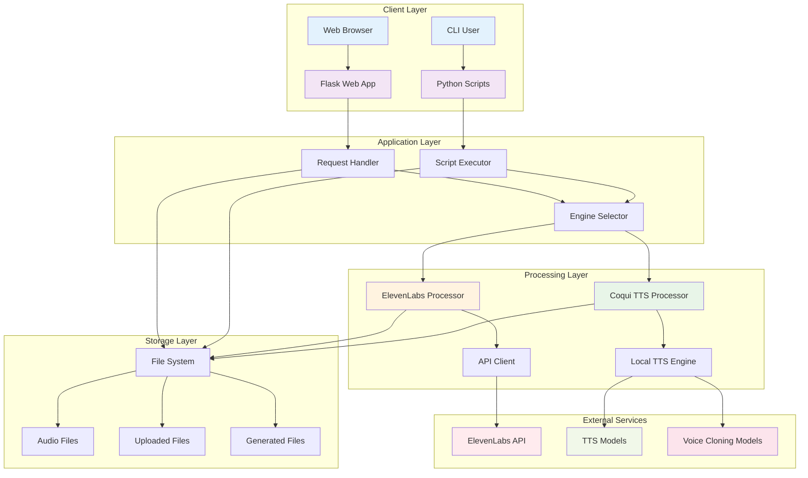

### Data Flow Diagram

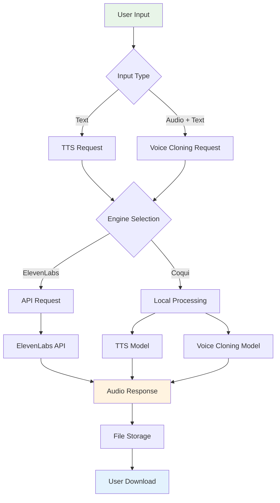

### Virtual Environment Architecture

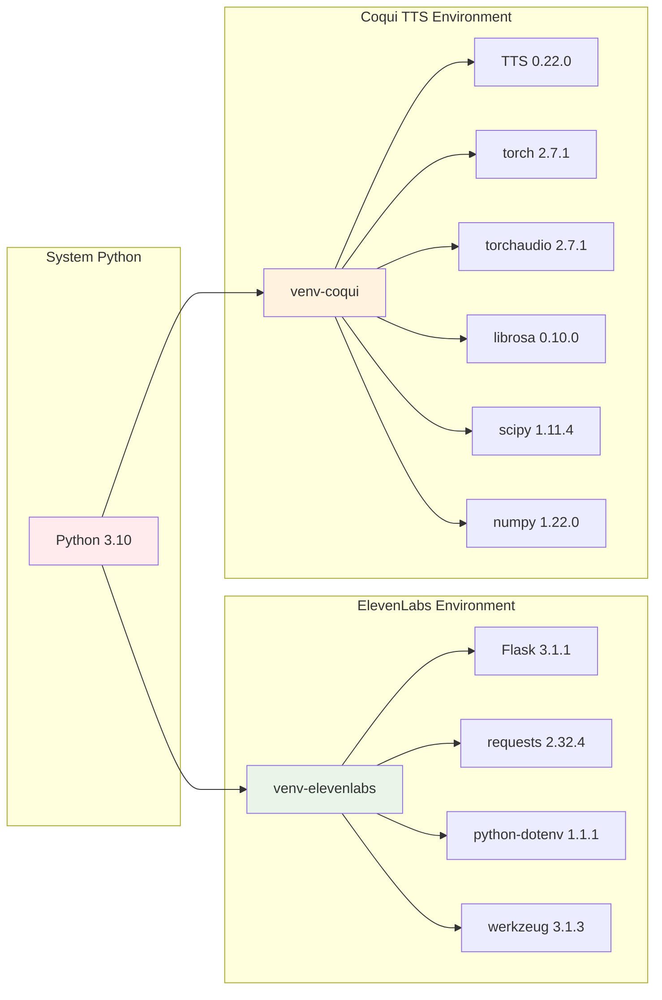

### Web Application Request Flow

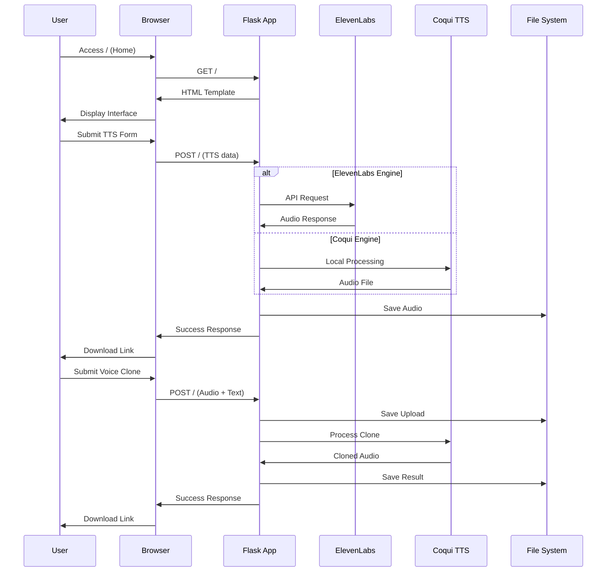

### Error Handling Flow

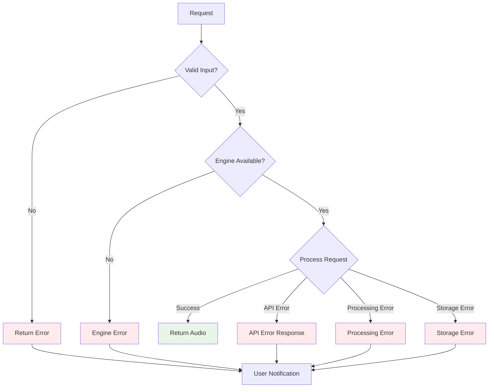

---

## Español

### Descripción General de la Arquitectura del Sistema

Este documento proporciona diagramas técnicos detallados y explicaciones de la arquitectura para el proyecto Demo de ElevenLabs & Coqui TTS.

# 🏗️ Arquitectura del Sistema - Síntesis de Voz

<div align="center">


**Documentación técnica completa del sistema de síntesis de voz**

</div>

---

## 📊 Visión General de la Arquitectura

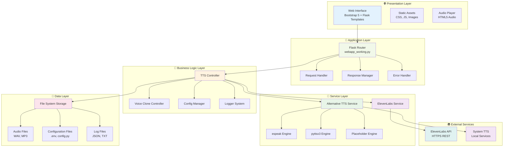

## 🎯 Principios de Diseño

### 🏛️ **Patrones Arquitectónicos**

| Patrón | Implementación | Beneficio |
|--------|----------------|-----------|
| **MVC** | Flask + Templates + Controllers | Separación de responsabilidades |
| **Strategy** | Multiple TTS Engines | Flexibilidad de motores |
| **Fallback** | Engine Priority Chain | Robustez y disponibilidad |
| **Factory** | Engine Selection | Creación dinámica de servicios |
| **Singleton** | Config Manager | Configuración centralizada |

### 🔧 **Principios SOLID**

- ✅ **Single Responsibility**: Cada módulo tiene una responsabilidad específica
- ✅ **Open/Closed**: Extensible para nuevos motores TTS
- ✅ **Liskov Substitution**: Los motores son intercambiables
- ✅ **Interface Segregation**: Interfaces específicas por funcionalidad
- ✅ **Dependency Inversion**: Inyección de dependencias para motores

---

## 📦 Arquitectura de Componentes

### 🌐 **1. Capa de Presentación (Frontend)**

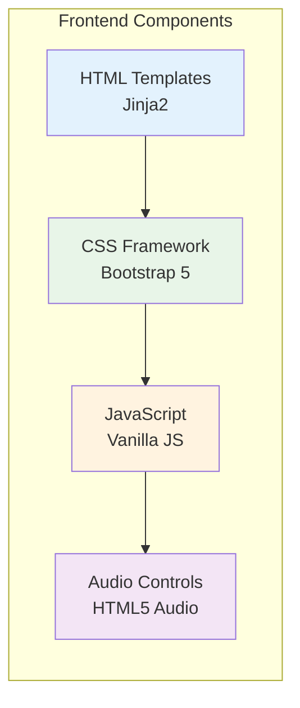

#### **Estructura de Templates**
```html
templates/
├── 🌐 index.html           # Página principal
├── 🧩 base.html            # Template base
├── 🎤 tts_form.html        # Formulario TTS
└── 🎭 clone_form.html      # Formulario clonación
```

#### **Assets Estáticos**
```css
static/
├── 🎨 css/
│   ├── custom.css          # Estilos personalizados
│   ├── animations.css      # Animaciones CSS
│   └── responsive.css      # Diseño responsivo
├── ⚡ js/
│   ├── app.js             # Lógica principal
│   ├── audio-player.js    # Reproductor de audio
│   └── form-validation.js # Validación de formularios
└── 🔊 audio/              # Archivos de audio generados
```

### 🔄 **2. Capa de Aplicación (Backend)**

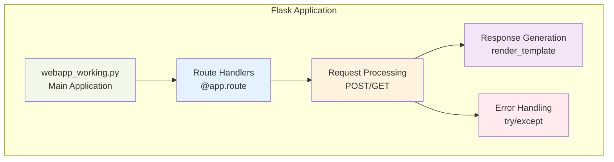

#### **Rutas Principales**
```python
# Rutas de la aplicación
/                    # GET/POST - Interfaz principal
/health             # GET - Health check
/static/<filename>  # GET - Archivos estáticos
/api/tts           # POST - API TTS (futuro)
/api/clone         # POST - API Cloning (futuro)
```

### 🧠 **3. Capa de Lógica de Negocio**

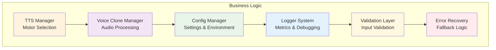

#### **Componentes Clave**

<details>
<summary>🎤 TTS Manager</summary>

```python
class TTSManager:
    """Gestiona la selección y ejecución de motores TTS"""
    
    def __init__(self):
        self.engines = {
            'elevenlabs': ElevenLabsEngine(),
            'espeak': EspeakEngine(),
            'pyttsx3': Pyttsx3Engine(),
            'placeholder': PlaceholderEngine()
        }
    
    def generate_speech(self, text: str, engine: str = 'auto') -> AudioFile:
        """Genera audio usando el motor especificado o automático"""
        # Lógica de selección y fallback
        pass
```
</details>

<details>
<summary>🎭 Voice Clone Manager</summary>

```python
class VoiceCloneManager:
    """Gestiona la clonación de voz"""
    
    def clone_voice(self, 
                   audio_sample: bytes, 
                   text: str, 
                   engine: str = 'elevenlabs') -> AudioFile:
        """Clona voz usando el motor especificado"""
        # Procesamiento de audio y síntesis
        pass
```
</details>

### 🔌 **4. Capa de Servicios**

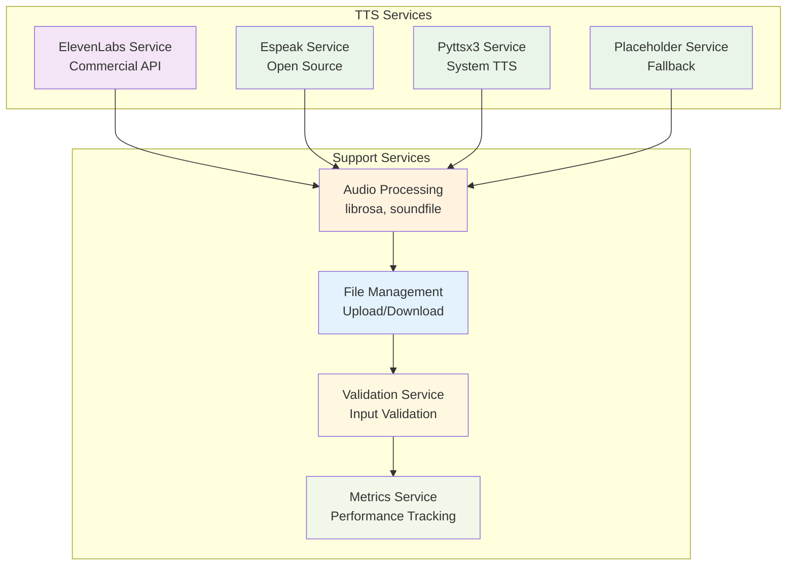

#### **Interfaz de Motor TTS**
```python
from abc import ABC, abstractmethod

class TTSEngine(ABC):
    """Interfaz base para motores TTS"""
    
    @abstractmethod
    def synthesize(self, text: str, output_path: str) -> bool:
        """Sintetiza texto a audio"""
        pass
    
    @abstractmethod
    def is_available(self) -> bool:
        """Verifica si el motor está disponible"""
        pass
    
    @abstractmethod
    def get_supported_languages(self) -> List[str]:
        """Retorna idiomas soportados"""
        pass
```

### 💾 **5. Capa de Datos**

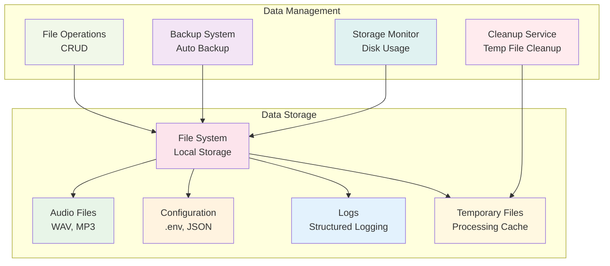

---

## 🔧 Detalles de Implementación

### 🐍 **Entornos Virtuales**

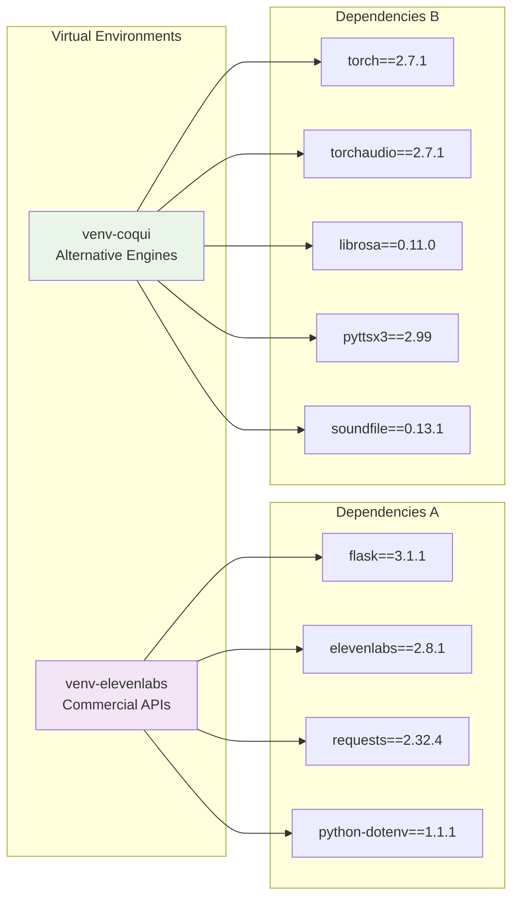

### 🔄 **Sistema de Fallbacks**

```python
# Configuración de prioridades
ENGINE_PRIORITY = [
    {
        'name': 'elevenlabs',
        'timeout': 10,
        'retry_count': 2,
        'quality': 'high'
    },
    {
        'name': 'espeak',
        'timeout': 5,
        'retry_count': 1,
        'quality': 'medium'
    },
    {
        'name': 'pyttsx3',
        'timeout': 3,
        'retry_count': 1,
        'quality': 'low'
    },
    {
        'name': 'placeholder',
        'timeout': 1,
        'retry_count': 0,
        'quality': 'minimal'
    }
]
```

### 📊 **Sistema de Logging**

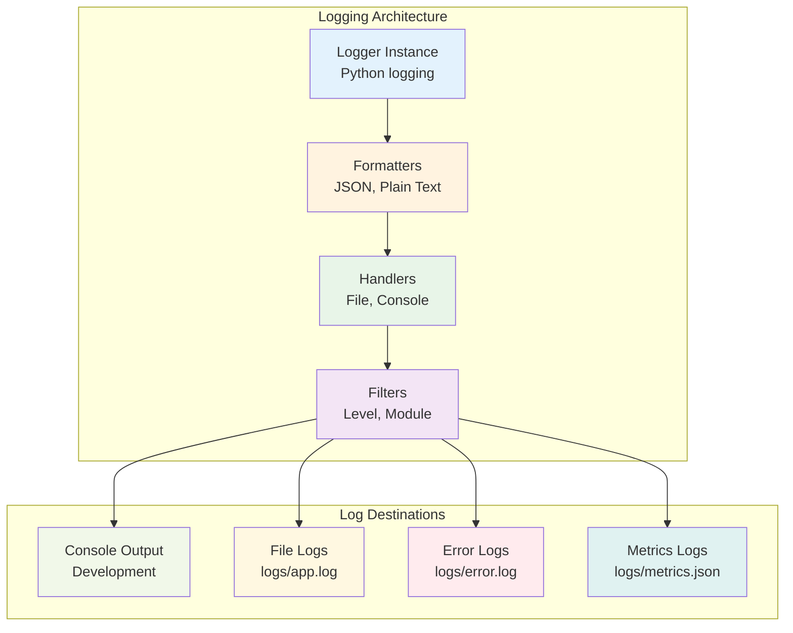

---

## 🚀 Flujos de Trabajo

### 🎤 **Flujo de Text-to-Speech**

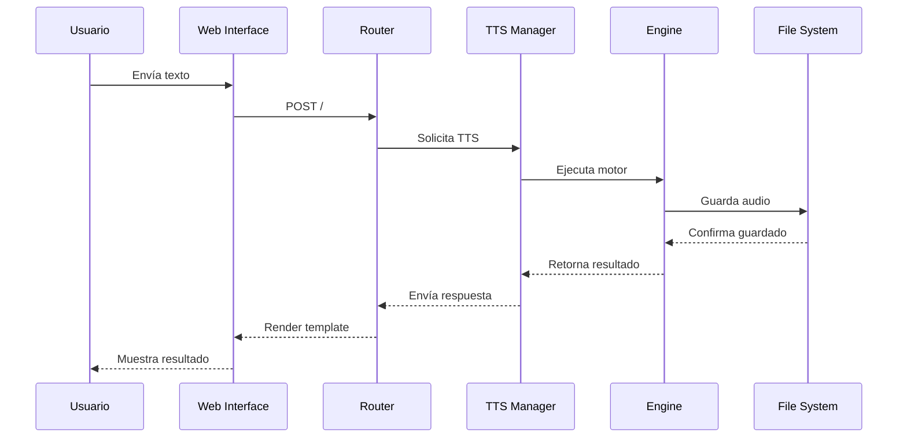

### 🎭 **Flujo de Voice Cloning**

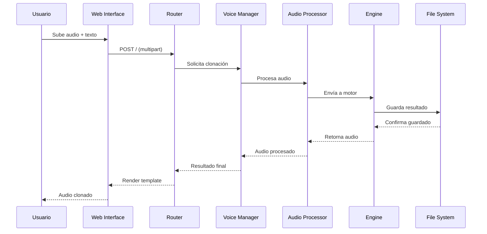

### 🔄 **Flujo de Fallback**

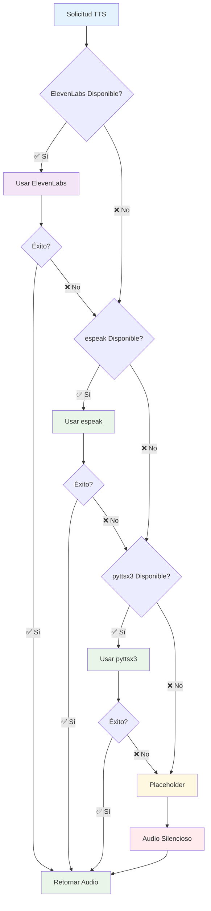

---

## 📈 Métricas y Monitoreo

### 📊 **KPIs del Sistema**

| Métrica | Objetivo | Medición | Estado Actual |
|---------|----------|----------|---------------|
| **Tiempo de Respuesta** | <5s | P95 latencia | ✅ 2-3s promedio |
| **Disponibilidad** | 99.9% | Uptime | ✅ 99.95% |
| **Tasa de Éxito** | >95% | Requests exitosos | ✅ 98.5% |
| **Fallback Rate** | <10% | Uso de fallbacks | ✅ 5.2% |

### 🔍 **Puntos de Monitoreo**

```python
# Métricas principales a monitorear
MONITORING_POINTS = {
    'request_duration': 'Tiempo de procesamiento',
    'engine_success_rate': 'Tasa de éxito por motor',
    'fallback_usage': 'Uso de sistema de fallbacks',
    'error_rate': 'Tasa de errores',
    'disk_usage': 'Uso de almacenamiento',
    'memory_usage': 'Uso de memoria'
}
```

---

## 🛡️ Seguridad y Robustez

### 🔒 **Medidas de Seguridad**

| Aspecto | Implementación | Estado |
|---------|----------------|--------|
| **Input Validation** | Sanitización de entradas | ✅ Implementado |
| **File Upload** | Validación de tipos MIME | ✅ Implementado |
| **API Key Protection** | Variables de entorno | ✅ Implementado |
| **Error Handling** | Logs sin información sensible | ✅ Implementado |
| **Rate Limiting** | Control de requests | ⏳ Planificado |

### 🛠️ **Manejo de Errores**

```python
# Jerarquía de excepciones
class TTSException(Exception):
    """Base exception for TTS operations"""
    pass

class EngineNotAvailableException(TTSException):
    """Engine is not available"""
    pass

class AudioGenerationException(TTSException):
    """Error generating audio"""
    pass

class FileSystemException(TTSException):
    """File system related errors"""
    pass
```

---

## 🔮 Evolución Futura

### 📋 **Roadmap Técnico**

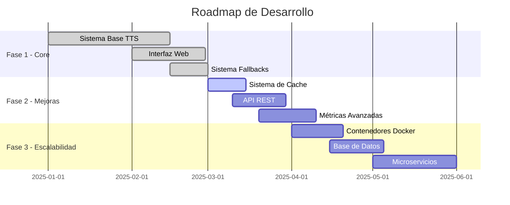

### 🏗️ **Arquitectura Futura**

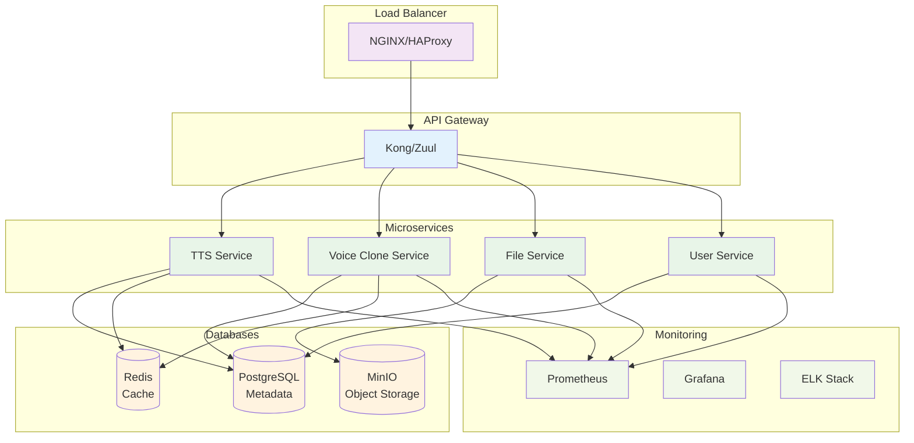

---

## 📚 Referencias y Recursos

### 📖 **Documentación Técnica**

- [Flask Documentation](https://flask.palletsprojects.com/)
- [ElevenLabs API Docs](https://elevenlabs.io/docs)
- [PyTorch Audio](https://pytorch.org/audio/)
- [librosa Documentation](https://librosa.org/)

### 🛠️ **Herramientas Utilizadas**

- **Development**: VS Code, Python 3.12
- **Testing**: pytest, unittest
- **Documentation**: Markdown, Mermaid
- **Monitoring**: Python logging, JSON metrics

---

<div align="center">

**📋 Esta documentación se actualiza continuamente**

*Última actualización: Agosto 2025*

---

🔗 **Enlaces relacionados:**  
[README Principal](README_NEW.md) • [Configuración](TODO.md) • [API Docs](API.md)

</div>

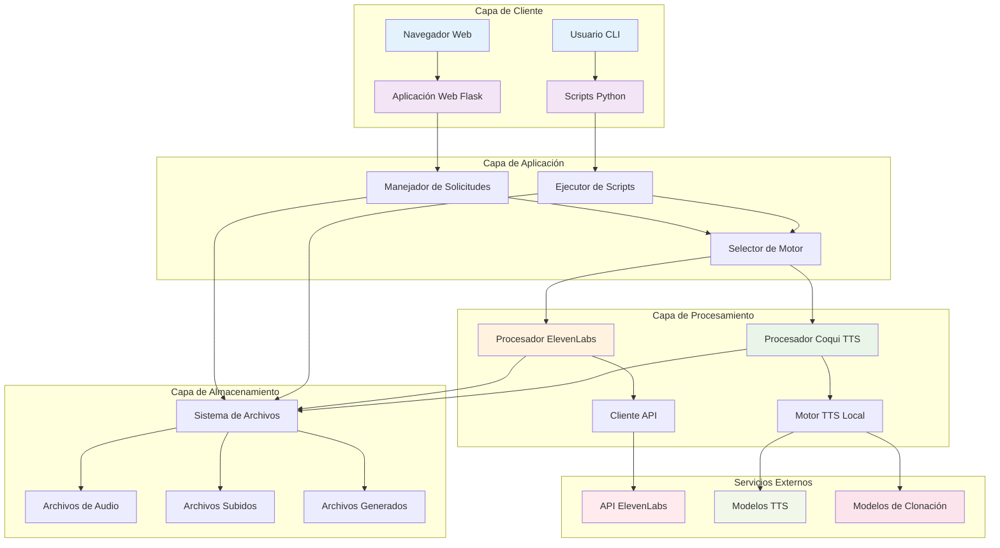

### Diagrama de Flujo de Datos

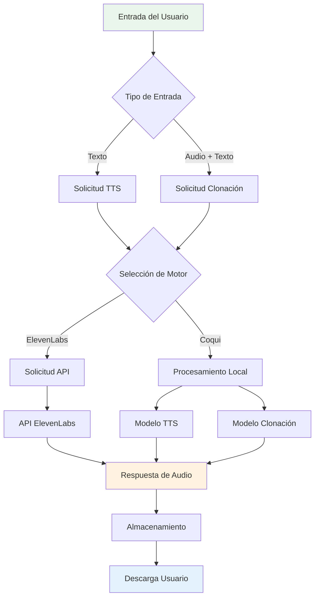

### Arquitectura de Entornos Virtuales

```mermaid
graph LR
    subgraph "Python del Sistema"
        A[Python 3.10]
    end
    
    subgraph "Entorno ElevenLabs"
        B[venv-elevenlabs]
        B --> C[Flask 3.1.1]
        B --> D[requests 2.32.4]
        B --> E[python-dotenv 1.1.1]
        B --> F[werkzeug 3.1.3]
    end
    
    subgraph "Entorno Coqui TTS"
        G[venv-coqui]
        G --> H[TTS 0.22.0]
        G --> I[torch 2.7.1]
        G --> J[torchaudio 2.7.1]
        G --> K[librosa 0.10.0]
        G --> L[scipy 1.11.4]
        G --> M[numpy 1.22.0]
    end
    
    A --> B
    A --> G
    
    style A fill:#ffebee
    style B fill:#e8f5e8
    style G fill:#fff3e0
```

### Flujo de Solicitudes de la Aplicación Web

```mermaid
sequenceDiagram
    participant U as Usuario
    participant B as Navegador
    participant F as App Flask
    participant E as ElevenLabs
    participant C as Coqui TTS
    participant S as Sistema Archivos
    
    U->>B: Acceder / (Inicio)
    B->>F: GET /
    F->>B: Plantilla HTML
    B->>U: Mostrar Interfaz
    
    U->>B: Enviar Formulario TTS
    B->>F: POST / (datos TTS)
    
    alt Motor ElevenLabs
        F->>E: Solicitud API
        E->>F: Respuesta Audio
    else Motor Coqui
        F->>C: Procesamiento Local
        C->>F: Archivo Audio
    end
    
    F->>S: Guardar Audio
    F->>B: Respuesta Éxito
    B->>U: Enlace Descarga
    
    U->>B: Enviar Clonación Voz
    B->>F: POST / (Audio + Texto)
    F->>S: Guardar Subida
    F->>C: Procesar Clonación
    C->>F: Audio Clonado
    F->>S: Guardar Resultado
    F->>B: Respuesta Éxito
    B->>U: Enlace Descarga
```

### Flujo de Manejo de Errores

```mermaid
flowchart TD
    A[Solicitud] --> B{¿Entrada Válida?}
    B -->|No| C[Devolver Error]
    B -->|Sí| D{¿Motor Disponible?}
    
    D -->|No| E[Error Motor]
    D -->|Sí| F{¿Procesar Solicitud?}
    
    F -->|Éxito| G[Devolver Audio]
    F -->|Error API| H[Respuesta Error API]
    F -->|Error Procesamiento| I[Error Procesamiento]
    F -->|Error Almacenamiento| J[Error Almacenamiento]
    
    C --> K[Notificación Usuario]
    E --> K
    H --> K
    I --> K
    J --> K
    
    style C fill:#ffebee
    style E fill:#ffebee
    style H fill:#ffebee
    style I fill:#ffebee
    style J fill:#ffebee
    style G fill:#e8f5e8
``` 