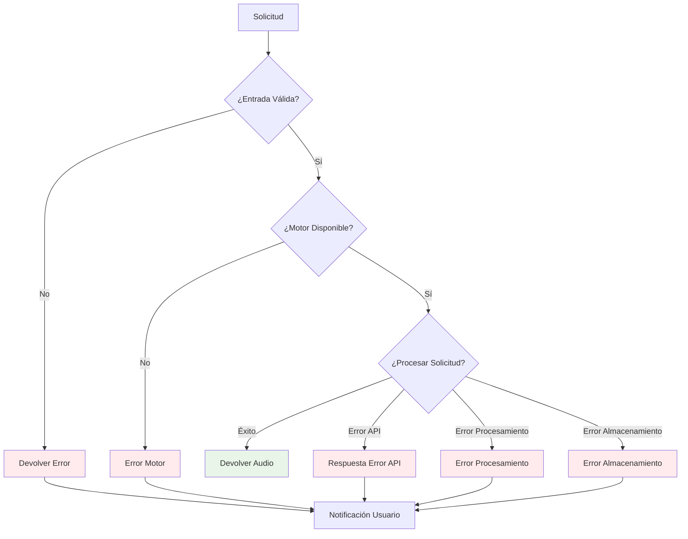

# Architecture Documentation / Documentación de Arquitectura

[English](#english) | [Español](#español)

---

## English

### System Architecture Overview

This document provides detailed technical architecture diagrams and explanations for the ElevenLabs & Coqui TTS Demo project.

### High-Level System Architecture

### Data Flow Diagram

### Virtual Environment Architecture

### Web Application Request Flow

### Error Handling Flow

---

## Español

### Descripción General de la Arquitectura del Sistema

Este documento proporciona diagramas técnicos detallados y explicaciones de la arquitectura para el proyecto Demo de ElevenLabs & Coqui TTS.

### Arquitectura del Sistema de Alto Nivel

### Diagrama de Flujo de Datos

### Arquitectura de Entornos Virtuales

### Flujo de Solicitudes de la Aplicación Web

### Flujo de Manejo de Errores

