# 🤝 Guía de Contribución

<div align="center">


**¡Únete al desarrollo del sistema de síntesis de voz!**

</div>

---

## 🌟 ¿Por qué Contribuir?

Contribuir a este proyecto te permitirá:

- 🎯 **Impactar** en una tecnología de síntesis de voz de código abierto
- 🧠 **Aprender** sobre AI, TTS, y desarrollo web moderno
- 👥 **Colaborar** con una comunidad técnica activa
- 🚀 **Mejorar** tus habilidades en Python, Flask, y APIs

---

## 🚀 Proceso de Contribución

```mermaid
flowchart LR
    A[🍴 Fork] --> B[🌿 Branch]
    B --> C[💻 Code]
    C --> D[🧪 Test]
    D --> E[📝 Commit]
    E --> F[📤 Push]
    F --> G[🔄 PR]
    G --> H[👀 Review]
    H --> I[✅ Merge]
    
    style A fill:#e3f2fd
    style I fill:#c8e6c9
```



### 1️⃣ **Preparar el Entorno**

```bash
# Hacer fork del repositorio en GitHub
# Luego clonar tu fork
git clone https://github.com/TU_USUARIO/s-ntesis-de-voz.git
cd s-ntesis-de-voz

# Agregar upstream remote
git remote add upstream https://github.com/EdissonGirald0/s-ntesis-de-voz.git

# Configurar entorno de desarrollo
python3 setup_environments.py
source venv-elevenlabs/bin/activate
```

### 2️⃣ **Crear Nueva Funcionalidad**

```bash
# Actualizar desde upstream
git fetch upstream
git checkout main
git merge upstream/main

# Crear nueva rama
git checkout -b feature/nueva-funcionalidad

# O para bugfix
git checkout -b bugfix/corregir-error
```

### 3️⃣ **Desarrollar y Probar**

```bash
# Hacer cambios en el código
# ...

# Ejecutar tests
python3 -m pytest tests/ -v

# Verificar calidad de código
black app/
flake8 app/

# Probar manualmente
python3 app/webapp_working.py
```

### 4️⃣ **Commit y Push**

```bash
# Hacer commit con mensaje descriptivo
git add .
git commit -m "feat: agregar sistema de cache para audios

- Implementa cache basado en Redis
- Mejora performance en 60%
- Añade configuración de TTL
- Incluye tests unitarios

Closes #123"

# Push a tu fork
git push origin feature/nueva-funcionalidad
```

### 5️⃣ **Crear Pull Request**

1. Ve a GitHub y crea un Pull Request
2. Usa el template de PR
3. Asegúrate de que pase todos los checks
4. Responde a comentarios de revisión

---

## 📝 Estándares de Código

### 🐍 **Python Style Guide**

Seguimos [PEP 8](https://peps.python.org/pep-0008/) con estas especificaciones:

```python
# ✅ Buenas prácticas
class TTSEngine:
    \"\"\"Engine para síntesis de texto a voz.
    
    Args:
        api_key: API key del servicio
        voice_id: ID de la voz a usar
    \"\"\"
    
    def __init__(self, api_key: str, voice_id: str) -> None:
        self.api_key = api_key
        self.voice_id = voice_id
        
    def synthesize(self, text: str) -> bytes:
        \"\"\"Sintetiza texto a audio.
        
        Args:
            text: Texto a sintetizar
            
        Returns:
            Audio en formato bytes
            
        Raises:
            TTSError: Si falla la síntesis
        \"\"\"
        # Implementation here
        pass

# ❌ Evitar
class ttsEngine:  # PascalCase para clases
    def synthesize(self,text):  # Space after comma
        return None  # Documentación faltante
```

### 🎨 **Formatting Tools**

```bash
# Black para formateo automático
black app/ tests/

# isort para imports
isort app/ tests/

# flake8 para linting
flake8 app/ tests/

# mypy para type checking
mypy app/
```

### 📦 **Estructura de Archivos**

```
app/
├── __init__.py              # Package initialization
├── core/                    # Lógica core del negocio
│   ├── __init__.py
│   ├── tts_engine.py       # Engine TTS principal
│   └── voice_cloner.py     # Clonación de voz
├── api/                    # Endpoints de API
│   ├── __init__.py
│   ├── routes.py          # Rutas de Flask
│   └── schemas.py         # Validación con Pydantic
├── utils/                 # Utilidades
│   ├── __init__.py
│   ├── config.py         # Configuración
│   └── logging.py        # Setup de logging
└── tests/                # Tests (espejo de app/)
    ├── __init__.py
    ├── test_tts_engine.py
    └── test_api.py
```

---

## 🧪 Testing Guidelines

### ✅ **Tipos de Tests**

```python
# Unit Tests - Funciones individuales
def test_synthesize_text():
    engine = TTSEngine(api_key="test", voice_id="test")
    result = engine.synthesize("Hello world")
    assert isinstance(result, bytes)
    assert len(result) > 0

# Integration Tests - Múltiples componentes
def test_full_tts_pipeline():
    app = create_app(testing=True)
    with app.test_client() as client:
        response = client.post('/api/tts', json={
            'text': 'Hello world',
            'voice_id': 'test_voice'
        })
        assert response.status_code == 200

# E2E Tests - Usuario completo
def test_web_interface():
    # Selenium o similar para testing de UI
    pass
```

### 📊 **Coverage Requirements**

```bash
# Ejecutar tests con coverage
coverage run -m pytest tests/
coverage report -m
coverage html

# Objetivos de coverage:
# - Funciones core: 90%+
# - Utilities: 80%+
# - API endpoints: 85%+
# - Overall: 80%+
```

### 🎯 **Test Naming Convention**

```python
# ✅ Buenos nombres
def test_synthesize_returns_audio_bytes():
def test_invalid_api_key_raises_authentication_error():
def test_empty_text_returns_validation_error():

# ❌ Malos nombres
def test_function():
def test_1():
def test_stuff():
```

---

## 📋 Tipos de Contribuciones

### 🐛 **Bug Reports**

#### **Template para Issues de Bugs:**
```markdown
## 🐛 Descripción del Bug
Descripción clara y concisa del problema.

## 🔄 Pasos para Reproducir
1. Ve a '...'
2. Haz click en '...'
3. Ejecuta comando '...'
4. Ve el error

## ✅ Comportamiento Esperado
Lo que debería pasar normalmente.

## 📸 Screenshots
Si aplica, agrega screenshots.

## 🖥️ Entorno
- OS: [e.g. Ubuntu 24.04]
- Python: [e.g. 3.12.1]
- Versión del proyecto: [e.g. v1.2.0]

## 📋 Información Adicional
Cualquier contexto adicional sobre el problema.
```

### ✨ **Feature Requests**

#### **Template para Nuevas Funcionalidades:**
```markdown
## 🚀 Descripción de la Funcionalidad
Descripción clara de la nueva funcionalidad.

## 💡 Problema que Resuelve
¿Qué problema específico resuelve esta funcionalidad?

## 🎯 Solución Propuesta
Describe cómo te gustaría que funcionara.

## 🔄 Alternativas Consideradas
Otras alternativas que has considerado.

## 📊 Impacto
- Performance: [Mejora/Neutral/Empeora]
- Complejidad: [Baja/Media/Alta]
- Breaking changes: [Sí/No]

## ✅ Criteria de Aceptación
- [ ] Criterio 1
- [ ] Criterio 2
- [ ] Criterio 3
```

### 📖 **Documentation Improvements**

```markdown
## 📚 Mejoras de Documentación

### Área a Mejorar:
- [ ] README.md
- [ ] API Documentation
- [ ] Code Comments
- [ ] Installation Guide
- [ ] Examples

### Descripción:
Qué específicamente se puede mejorar y por qué.

### Propuesta:
Cómo planeas mejorarlo.
```

---

## 🏷️ Git Workflow

### 📝 **Commit Message Format**

Usamos [Conventional Commits](https://www.conventionalcommits.org/):

```bash
# Estructura
<type>[optional scope]: <description>

[optional body]

[optional footer(s)]

# Ejemplos
feat(tts): add caching system for audio generation
fix(api): resolve rate limiting bug in /synthesize endpoint
docs(readme): update installation instructions
refactor(core): simplify voice cloning logic
test(api): add integration tests for voice endpoints
```

### 🎯 **Tipos de Commit**

| Tipo | Descripción | Ejemplo |
|------|-------------|---------|
| `feat` | Nueva funcionalidad | `feat: add batch processing` |
| `fix` | Corrección de bug | `fix: resolve memory leak` |
| `docs` | Documentación | `docs: update API guide` |
| `style` | Formato/estilo | `style: format with black` |
| `refactor` | Refactoring | `refactor: simplify TTS logic` |
| `test` | Tests | `test: add unit tests` |
| `chore` | Mantenimiento | `chore: update dependencies` |

### 🌿 **Branch Naming**

```bash
# Feature branches
feature/audio-caching
feature/user-authentication
feature/voice-preview

# Bug fix branches
bugfix/memory-leak-fix
bugfix/api-rate-limiting
hotfix/security-patch

# Documentation branches
docs/api-documentation
docs/installation-guide
```

---

## 👀 Code Review Process

### 🔍 **Como Reviewer**

#### **Checklist de Review:**

- [ ] **Funcionalidad**
  - ¿El código hace lo que dice hacer?
  - ¿Maneja casos edge correctamente?
  - ¿Es consistente con el resto del codebase?

- [ ] **Tests**
  - ¿Hay tests para el nuevo código?
  - ¿Los tests existentes aún pasan?
  - ¿El coverage se mantiene/mejora?

- [ ] **Performance**
  - ¿Introduce problemas de performance?
  - ¿Usa recursos eficientemente?
  - ¿Hay oportunidades de optimización?

- [ ] **Security**
  - ¿Introduce vulnerabilidades?
  - ¿Maneja input validation?
  - ¿Sigue best practices de seguridad?

- [ ] **Código**
  - ¿Es legible y mantenible?
  - ¿Sigue el style guide?
  - ¿Está bien documentado?

### 💬 **Feedback Constructivo**

```markdown
# ✅ Feedback constructivo
## Sugerencia
Considera usar `asyncio` aquí para mejorar la performance:
```python
async def synthesize_batch(texts: List[str]) -> List[bytes]:
    tasks = [synthesize_single(text) for text in texts]
    return await asyncio.gather(*tasks)
```

## Pregunta
¿Has considerado el caso donde `text` es None? Podríamos agregar validación:
```python
if not text or not text.strip():
    raise ValueError("Text cannot be empty")
```

# ❌ Feedback poco útil
Este código está mal.
Cambia esto.
No me gusta este approach.
```

### 🚀 **Como Autor del PR**

#### **Preparar tu PR:**

1. **Descripción clara** del cambio y por qué
2. **Tests** que demuestren que funciona
3. **Screenshots** si hay cambios visuales
4. **Breaking changes** claramente marcados
5. **Documentación** actualizada

#### **Responder a Reviews:**

```markdown
# ✅ Buenas respuestas
Tienes razón, ese caso edge no está cubierto. Lo agregué en el commit abc123.

Excelente punto sobre performance. Implementé tu sugerencia de asyncio.

# ❌ Respuestas defensivas
Mi código está bien como está.
No veo por qué necesito cambiar esto.
```

---

## 🏆 Recognition

### 🌟 **Contributor Levels**

| Nivel | Criterios | Beneficios |
|-------|-----------|------------|
| **🌱 Newcomer** | 1-2 PRs merged | Mention en README |
| **🚀 Contributor** | 5+ PRs, 1+ feature | Colaborator access |
| **💎 Core Contributor** | 10+ PRs, mentoring | Write access, review privileges |
| **👑 Maintainer** | Long-term commitment | Full repository access |

### 🎖️ **Tipos de Contribuciones Valoradas**

- **🐛 Bug Fixes** - Especialmente con tests
- **✨ New Features** - Bien documentadas y testadas
- **📖 Documentation** - Mejoras, ejemplos, tutoriales
- **🧪 Testing** - Aumentar coverage, mejores tests
- **🎨 UX/UI** - Mejorar experiencia de usuario
- **⚡ Performance** - Optimizaciones medibles
- **🔒 Security** - Identificar y resolver vulnerabilidades
- **🤝 Community** - Ayudar otros contributors, mentoring

---

## 📞 Comunicación

### 💬 **Canales de Comunicación**

- **🐛 Issues**: Para bugs y feature requests
- **💡 Discussions**: Para ideas y preguntas generales
- **📧 Email**: Para asuntos privados/sensibles
- **💻 Code**: Para discusiones técnicas específicas

### 🗣️ **Guidelines de Comunicación**

- **🎯 Sé específico** - Proporciona contexto y detalles
- **🤝 Sé respetuoso** - Todos estamos aprendiendo
- **⚡ Sé responsivo** - Responde en tiempo razonable
- **🧠 Sé constructivo** - Enfócate en soluciones

---

## ⚖️ Code of Conduct

### 🤝 **Nuestros Valores**

- **Inclusividad** - Todos son bienvenidos
- **Respeto** - Trata a otros como quieres ser tratado
- **Colaboración** - Trabajamos mejor juntos
- **Aprendizaje** - Los errores son oportunidades
- **Transparencia** - Comunicación abierta y honesta

### 🚫 **Comportamientos Inaceptables**

- Lenguaje ofensivo o discriminatorio
- Ataques personales o trolling
- Acoso público o privado
- Publicar información privada sin permiso
- Cualquier conducta no profesional

### 📋 **Enforcement**

Las violaciones al código de conducta pueden reportarse a:
- Crear issue privado
- Contacto directo con maintainers
- GitHub's community guidelines

---

## 📚 Resources para Contributors

### 📖 **Learning Resources**

- [Python Best Practices](https://docs.python-guide.org/)
- [Flask Documentation](https://flask.palletsprojects.com/)
- [Git Tutorial](https://www.atlassian.com/git/tutorials)
- [Testing in Python](https://realpython.com/python-testing/)

### 🛠️ **Development Tools**

```bash
# Recommended VS Code extensions
code --install-extension ms-python.python
code --install-extension ms-python.black-formatter
code --install-extension ms-python.flake8
code --install-extension ms-python.mypy-type-checker
```

### 🎯 **First-Time Contributors**

¿Primera vez contribuyendo? Busca issues con estas etiquetas:

- `good first issue` - Perfectos para empezar
- `help wanted` - Necesitamos ayuda aquí
- `documentation` - Mejoras de docs (buen starting point)
- `tests` - Agregar tests (importante y accesible)

---

## 🎉 ¡Empezar a Contribuir!

### 🚀 **Quick Start**

1. **Fork** el repositorio
2. **Encuentra** un `good first issue`
3. **Comenta** que quieres trabajar en él
4. **Sigue** la guía de desarrollo
5. **Crea** tu primer PR

### 💡 **Ideas para Primeras Contribuciones**

- Corregir typos en documentación
- Agregar ejemplos de uso
- Mejorar mensajes de error
- Escribir tests para código existente
- Mejorar logging y debugging
- Optimizar imports y formatting

---

<div align="center">

**🙏 ¡Gracias por contribuir!**

*Tu trabajo hace que este proyecto sea mejor para todos*

---

**🔗 Enlaces útiles:**  
[Instalación](INSTALL.md) • [Arquitectura](ARCHITECTURE.md) • [API](API.md) • [Roadmap](TODO.md)

*Última actualización: Agosto 4, 2025*

</div>
