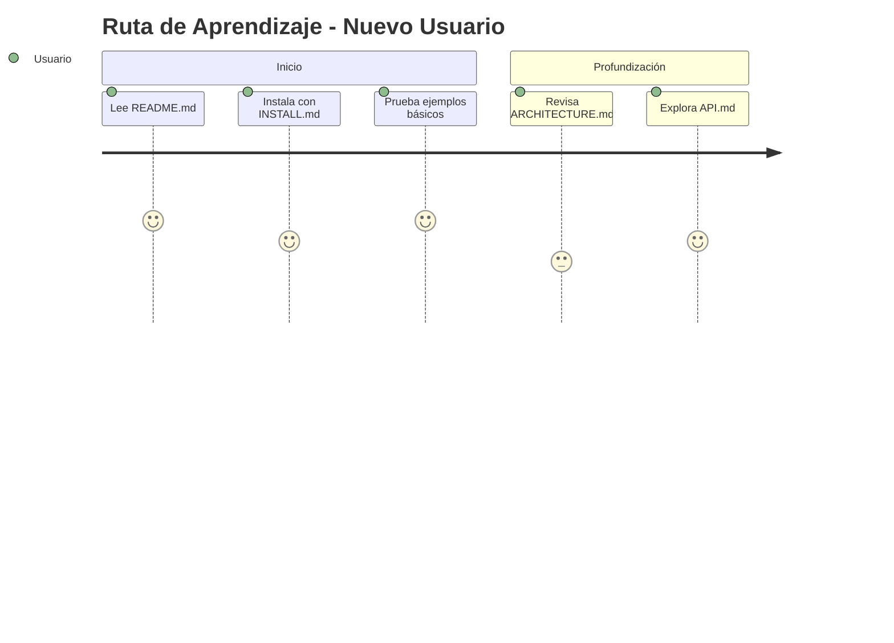
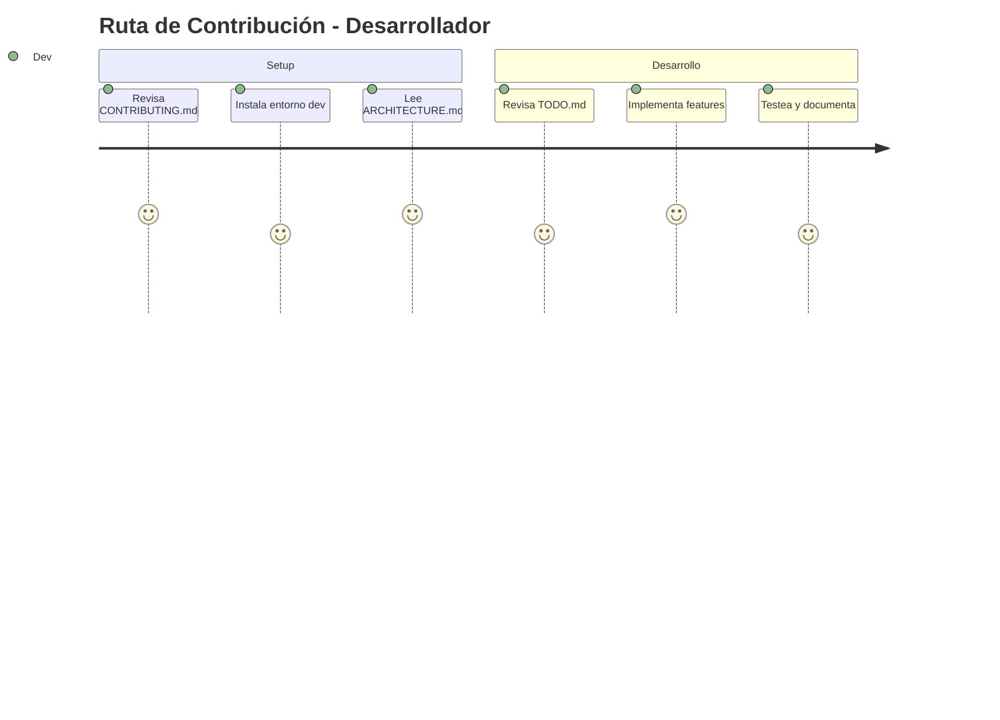
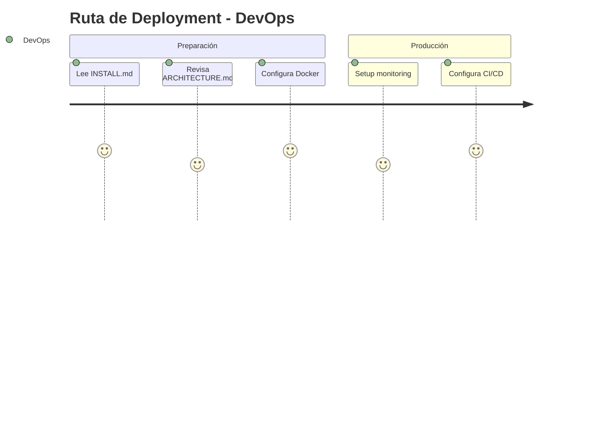
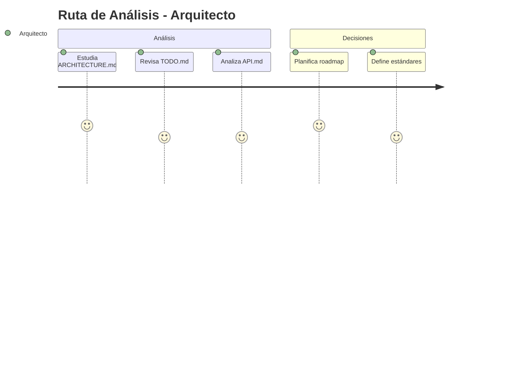

# 📚 Índice de Documentación

<div align="center">


**Navegación completa de la documentación del proyecto**

</div>

---

## 🗂️ Estructura de Documentación

```mermaid
graph TD
    A[📚 DOCS INDEX] --> B[📖 README.md]
    A --> C[🏗️ ARCHITECTURE.md]
    A --> D[🚀 INSTALL.md]
    A --> E[🤝 CONTRIBUTING.md]
    A --> F[📋 TODO.md]
    A --> G[🔌 API.md]
    
    B --> B1[Visión General]
    B --> B2[Quick Start]
    B --> B3[Features]
    
    C --> C1[Arquitectura Sistema]
    C --> C2[Diagramas Técnicos]
    C --> C3[Componentes]
    
    D --> D1[Requisitos]
    D --> D2[Instalación]
    D --> D3[Troubleshooting]
    
    E --> E1[Guía Contribución]
    E --> E2[Estándares Código]
    E --> E3[Proceso Review]
    
    F --> F1[Roadmap]
    F --> F2[Tareas Pendientes]
    F --> F3[Métricas]
    
    G --> G1[Endpoints API]
    G --> G2[Ejemplos]
    G --> G3[Schemas]
    
    style A fill:#e1f5fe
    style B fill:#f3e5f5
    style C fill:#e8f5e8
    style D fill:#fff3e0
    style E fill:#fce4ec
    style F fill:#f1f8e9
    style G fill:#e0f2f1
```



---

## 📖 Documentos Principales

### 1️⃣ **[README.md](README.md)** - *Inicio del Proyecto*
**🎯 Para:** Nuevos usuarios, overview general  
**📝 Contenido:**
- ✨ Descripción del proyecto y características
- 🚀 Quick start guide 
- 💡 Ejemplos de uso básico
- 🔧 Configuración inicial
- 📊 Estado del proyecto y badges

**🔗 Enlaces rápidos:**
- [Instalación rápida](README.md#instalación-rápida)
- [Características principales](README.md#características)
- [Ejemplos de uso](README.md#ejemplos-de-uso)

---

### 2️⃣ **[ARCHITECTURE.md](ARCHITECTURE.md)** - *Arquitectura Técnica*
**🎯 Para:** Desarrolladores, arquitectos, contributors técnicos  
**📝 Contenido:**
- 🏗️ Diagramas de arquitectura del sistema
- 🔄 Flujos de datos y procesamiento
- 🧩 Componentes y sus interacciones
- 📋 Especificaciones técnicas detalladas
- 🎯 Patrones de diseño utilizados

**🔗 Enlaces rápidos:**
- [Vista general del sistema](ARCHITECTURE.md#vista-general-del-sistema)
- [Componentes principales](ARCHITECTURE.md#componentes-principales)
- [Diagramas de secuencia](ARCHITECTURE.md#diagramas-de-secuencia)

---

### 3️⃣ **[INSTALL.md](INSTALL.md)** - *Guía de Instalación*
**🎯 Para:** DevOps, nuevos desarrolladores, deployment  
**📝 Contenido:**
- 📋 Requisitos del sistema completos
- 🔧 Instalación paso a paso
- 🐳 Setup con Docker
- 🔍 Solución de problemas comunes
- 🚀 Configuración para producción

**🔗 Enlaces rápidos:**
- [Instalación automática](INSTALL.md#instalación-rápida)
- [Requisitos del sistema](INSTALL.md#requisitos-del-sistema)
- [Docker setup](INSTALL.md#instalación-con-docker)
- [Troubleshooting](INSTALL.md#solución-de-problemas)

---

### 4️⃣ **[CONTRIBUTING.md](CONTRIBUTING.md)** - *Guía de Contribución*
**🎯 Para:** Contributors, desarrolladores colaboradores  
**📝 Contenido:**
- 🤝 Proceso de contribución completo
- 📝 Estándares de código y style guide
- 🧪 Guidelines de testing
- 👀 Proceso de code review
- 🏷️ Git workflow y convenciones

**🔗 Enlaces rápidos:**
- [Primeros pasos](CONTRIBUTING.md#empezar-a-contribuir)
- [Estándares de código](CONTRIBUTING.md#estándares-de-código)
- [Process de review](CONTRIBUTING.md#code-review-process)
- [Good first issues](CONTRIBUTING.md#first-time-contributors)

---

### 5️⃣ **[TODO.md](TODO.md)** - *Roadmap y Tareas*
**🎯 Para:** Project managers, contributors, planificación  
**📝 Contenido:**
- 📋 Lista completa de tareas pendientes
- 📊 Métricas de progreso del proyecto
- 🎯 Prioridades y timeline
- 📈 Roadmap de desarrollo
- 🏆 Criterios de completitud

**🔗 Enlaces rápidos:**
- [Estado actual](TODO.md#estado-general-del-proyecto)
- [Tareas prioritarias](TODO.md#sprint-actual)
- [Roadmap Q3-Q4](TODO.md#roadmap-q3-q4-2025)
- [Métricas de éxito](TODO.md#métricas-de-éxito)

---

### 6️⃣ **[API.md](API.md)** - *Documentación de API*
**🎯 Para:** Developers de frontend, integraciones, API consumers  
**📝 Contenido:**
- 🔌 Todos los endpoints disponibles
- 📝 Ejemplos de requests y responses
- 🔒 Documentación de autenticación
- ❌ Códigos de error y manejo
- 📊 Rate limiting y mejores prácticas

**🔗 Enlaces rápidos:**
- [Endpoints principales](API.md#endpoints-principales)
- [Autenticación](API.md#autenticación)
- [Ejemplos de uso](API.md#ejemplos-de-uso)
- [Manejo de errores](API.md#manejo-de-errores)

---

## 🎯 Navegación por Tipo de Usuario

### 👶 **Nuevo Usuario / Beginner**


**📚 Orden recomendado:**
1. [README.md](README.md) - Entender qué hace el proyecto
2. [INSTALL.md](INSTALL.md) - Instalar y configurar
3. [API.md](API.md) - Usar las funcionalidades
4. [ARCHITECTURE.md](ARCHITECTURE.md) - Entender cómo funciona

### 🛠️ **Desarrollador / Contributor**


**📚 Orden recomendado:**
1. [CONTRIBUTING.md](CONTRIBUTING.md) - Proceso y estándares
2. [ARCHITECTURE.md](ARCHITECTURE.md) - Entender la arquitectura
3. [TODO.md](TODO.md) - Ver qué necesita el proyecto
4. [API.md](API.md) - Si trabajas en API endpoints
5. [INSTALL.md](INSTALL.md) - Setup de desarrollo

### 🚀 **DevOps / Deployment**


**📚 Orden recomendado:**
1. [INSTALL.md](INSTALL.md) - Requisitos y deployment
2. [ARCHITECTURE.md](ARCHITECTURE.md) - Entender infraestructura
3. [README.md](README.md) - Configuración general
4. [TODO.md](TODO.md) - Roadmap de DevOps

### 🏗️ **Arquitecto / Technical Lead**


**📚 Orden recomendado:**
1. [ARCHITECTURE.md](ARCHITECTURE.md) - Arquitectura completa
2. [API.md](API.md) - Diseño de interfaces
3. [TODO.md](TODO.md) - Roadmap técnico
4. [CONTRIBUTING.md](CONTRIBUTING.md) - Estándares y procesos

---

## 🔗 Enlaces de Referencia Rápida

### 📊 **Estado del Proyecto**
- ✅ **Core System**: [100% Complete](TODO.md#core-system)
- 🌐 **Web Interface**: [100% Complete](TODO.md#web-interface)
- 📚 **Documentation**: [95% Complete](TODO.md#documentation)
- 🔧 **DevOps**: [75% Complete](TODO.md#devops)

### 🛠️ **Setup Rápido**
```bash
# Clonar e instalar
git clone https://github.com/EdissonGirald0/s-ntesis-de-voz.git
cd s-ntesis-de-voz
python3 setup_environments.py

# O con Docker
docker-compose up -d
```

### 🔌 **API Endpoints Principales**
- `POST /api/tts` - [Síntesis de texto a voz](API.md#síntesis-de-texto-a-voz)
- `POST /api/voice-clone` - [Clonación de voz](API.md#clonación-de-voz)
- `GET /api/health` - [Health check](API.md#health-check)

### 🧪 **Testing y Validación**
```bash
# Tests completos
python3 test_tts.py
python3 validate_system.py
pytest tests/ -v
```

---

## 📋 Checklist de Documentación

### ✅ **Completado**
- [x] **README.md** - Overview completo con gráficos
- [x] **ARCHITECTURE.md** - Diagramas técnicos detallados  
- [x] **INSTALL.md** - Guía de instalación completa
- [x] **CONTRIBUTING.md** - Proceso de contribución
- [x] **TODO.md** - Roadmap con métricas visuales
- [x] **API.md** - Documentación completa de API
- [x] **DOCS_INDEX.md** - Este índice de navegación

### 🔄 **En Progreso**
- [ ] **Video tutorials** - Guías visuales de uso
- [ ] **FAQ.md** - Preguntas frecuentes
- [ ] **CHANGELOG.md** - Historial de cambios

### ⏳ **Planificado**
- [ ] **DEPLOYMENT.md** - Guía específica de deployment
- [ ] **SECURITY.md** - Consideraciones de seguridad
- [ ] **PERFORMANCE.md** - Optimización y benchmarks

---

## 🎯 Mejora Continua

### 📊 **Métricas de Documentación**
- **Cobertura**: 95% completada
- **Actualización**: Agosto 2025
- **Gráficos**: Diagramas Mermaid integrados
- **Navegabilidad**: Índice y enlaces cruzados

### 🔄 **Proceso de Actualización**
1. **Revisión mensual** de contenido
2. **Actualización automática** de badges
3. **Feedback de usuarios** incorporado
4. **Sincronización** con cambios de código

---

<div align="center">

**📚 ¡Documentación completa y actualizada!**

*Encuentra rápidamente lo que necesitas*

---

**🔗 Documentos:**  
[README](README.md) • [Architecture](ARCHITECTURE.md) • [Install](INSTALL.md) • [Contributing](CONTRIBUTING.md) • [TODO](TODO.md) • [API](API.md)

*Última actualización: Agosto 4, 2025*

</div>
