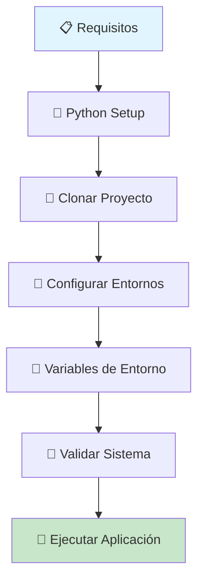

# 🚀 Guía de Instalación - Sistema de Síntesis de Voz

<div align="center">


**Instalación paso a paso del sistema completo**

</div>

---

## 🎯 Resumen de Instalación



### ⚡ **Instalación Rápida**
```bash
# Clon rápido y setup automático
git clone https://github.com/usuario/s-ntesis-de-voz.git
cd s-ntesis-de-voz
python3 setup_environments.py
```

---

## 📋 Requisitos del Sistema

### 🖥️ **Sistema Operativo**
- **Ubuntu 24.04 LTS** (recomendado)
- **Windows 10/11** (con WSL2)
- **macOS 12+** (parcialmente soportado)

### 🐍 **Python y Dependencias**
| Componente | Versión Mínima | Versión Recomendada | Estado |
|------------|----------------|---------------------|--------|
| Python | 3.10+ | 3.12+ | ✅ |
| pip | 21.0+ | 23.0+ | ✅ |
| venv | builtin | builtin | ✅ |
| espeak | 1.48+ | latest | ✅ |
| portaudio | 19+ | latest | ⚠️ |

### 💾 **Recursos del Sistema**
- **RAM**: 4GB mínimo, 8GB recomendado
- **Disco**: 2GB libres mínimo
- **CPU**: Dual-core mínimo
- **Red**: Conexión a internet para APIs

---

## 🔧 Instalación Paso a Paso

### 1️⃣ **Preparar el Sistema**

#### En Ubuntu/Debian:
```bash
# Actualizar el sistema
sudo apt update && sudo apt upgrade -y

# Instalar dependencias del sistema
sudo apt install -y python3 python3-pip python3-venv \
                    git wget curl espeak espeak-data \
                    portaudio19-dev python3-dev \
                    build-essential

# Verificar instalación
python3 --version  # Debe ser 3.10+
espeak --version   # Debe estar instalado
```

#### En Windows (WSL2):
```powershell
# Instalar WSL2 y Ubuntu
wsl --install -d Ubuntu-24.04

# Una vez en WSL, ejecutar comandos de Ubuntu arriba
```

#### En macOS:
```bash
# Instalar Homebrew si no está instalado
/bin/bash -c "$(curl -fsSL https://raw.githubusercontent.com/Homebrew/install/HEAD/install.sh)"

# Instalar dependencias
brew install python@3.12 espeak portaudio git
```

### 2️⃣ **Clonar el Proyecto**

```bash
# Clonar desde GitHub
git clone https://github.com/EdissonGirald0/s-ntesis-de-voz.git
cd s-ntesis-de-voz

# Verificar estructura del proyecto
ls -la
```

### 3️⃣ **Configurar Entornos Virtuales**

#### Opción A: Setup Automático (Recomendado)
```bash
# Ejecutar script de configuración automática
python3 setup_environments.py

# El script creará automáticamente:
# - venv-elevenlabs/
# - venv-coqui/
# - Instalará todas las dependencias
# - Validará la instalación
```

#### Opción B: Setup Manual
```bash
# Crear entorno para ElevenLabs
python3 -m venv venv-elevenlabs
source venv-elevenlabs/bin/activate
pip install --upgrade pip
pip install -r requirements.txt
deactivate

# Crear entorno para Coqui (fallback)
python3 -m venv venv-coqui
source venv-coqui/bin/activate
pip install --upgrade pip
pip install pyttsx3 soundfile numpy flask
deactivate
```

### 4️⃣ **Configurar Variables de Entorno**

```bash
# Copiar archivo de configuración de ejemplo
cp env.example .env

# Editar con tu editor preferido
nano .env  # o vim, code, etc.
```

#### 🔑 **Configuración Mínima Requerida:**
```bash
# En .env, configurar al menos:
ELEVENLABS_API_KEY=tu_api_key_aqui
FLASK_ENV=development
FLASK_DEBUG=True
SECRET_KEY=tu_clave_secreta_aqui
```

#### 🎯 **Obtener API Key de ElevenLabs:**
1. Visita [elevenlabs.io](https://elevenlabs.io/)
2. Crea una cuenta gratuita
3. Ve a tu perfil → API Keys
4. Copia la API key
5. Pégala en `.env`

### 5️⃣ **Validar la Instalación**

```bash
# Activar entorno ElevenLabs
source venv-elevenlabs/bin/activate

# Ejecutar validaciones
python3 validate_system.py

# Probar TTS básico
python3 test_tts.py

# Si todo está bien, verás:
# ✅ Sistema operativo compatible
# ✅ Python 3.12+ instalado
# ✅ Dependencias instaladas
# ✅ TTS engines funcionando
```

### 6️⃣ **Ejecutar la Aplicación**

```bash
# Asegurarse de estar en el entorno correcto
source venv-elevenlabs/bin/activate

# Ejecutar aplicación web
python3 app/webapp_working.py

# La aplicación estará disponible en:
# http://localhost:5000
```

---

## 🧪 Verificación Post-Instalación

### ✅ **Checklist de Validación**

- [ ] **Python 3.12+ funcionando**
  ```bash
  python3 --version
  ```

- [ ] **Entornos virtuales creados**
  ```bash
  ls venv-*/
  ```

- [ ] **Dependencias instaladas**
  ```bash
  source venv-elevenlabs/bin/activate
  pip list | grep -E "(flask|requests|elevenlabs)"
  ```

- [ ] **espeak funcionando**
  ```bash
  echo "Hola mundo" | espeak -s 150 -v es
  ```

- [ ] **Flask ejecutándose**
  ```bash
  curl http://localhost:5000
  ```

### 🧪 **Tests de Funcionalidad**

```bash
# Test completo del sistema
python3 -m pytest tests/ -v

# Test específico de TTS
python3 test_tts.py --verbose

# Test de la aplicación web
python3 -c "
import requests
r = requests.get('http://localhost:5000')
print(f'Status: {r.status_code}')
"
```

---

## 🔧 Solución de Problemas

### ❌ **Problemas Comunes**

#### **Error: ModuleNotFoundError**
```bash
# Solución: Verificar entorno virtual
source venv-elevenlabs/bin/activate
pip install -r requirements.txt
```

#### **Error: espeak command not found**
```bash
# Ubuntu/Debian
sudo apt install espeak espeak-data

# macOS
brew install espeak

# Windows WSL
sudo apt update && sudo apt install espeak
```

#### **Error: PortAudio**
```bash
# Ubuntu/Debian
sudo apt install portaudio19-dev

# macOS
brew install portaudio

# Luego reinstalar pyaudio
pip install --upgrade pyaudio
```

#### **Error: Permission denied en archivos**
```bash
# Verificar permisos
chmod +x setup_environments.py
chmod +x app/webapp_working.py

# Verificar ownership
sudo chown -R $USER:$USER .
```

### 🔍 **Debug Mode**

```bash
# Ejecutar con debug máximo
export FLASK_DEBUG=True
export LOG_LEVEL=DEBUG
python3 app/webapp_working.py --debug
```

### 📊 **Diagnóstico del Sistema**

```bash
# Script de diagnóstico completo
python3 -c "
import sys, platform, subprocess
print(f'OS: {platform.system()} {platform.release()}')
print(f'Python: {sys.version}')
print(f'Architecture: {platform.architecture()}')

# Verificar comandos
for cmd in ['espeak', 'git', 'curl']:
    try:
        result = subprocess.run([cmd, '--version'], 
                              capture_output=True, text=True)
        print(f'{cmd}: ✅ {result.stdout.split()[1] if result.stdout else \"OK\"}')
    except FileNotFoundError:
        print(f'{cmd}: ❌ No encontrado')
"
```

---

## 🐳 Instalación con Docker

### 📦 **Setup con Docker**

```bash
# Construir imagen
docker build -t tts-app .

# Ejecutar contenedor
docker run -p 5000:5000 \
           -e ELEVENLABS_API_KEY=tu_api_key \
           -v $(pwd)/uploads:/app/uploads \
           tts-app

# Con docker-compose
docker-compose up -d
```

### 📝 **docker-compose.yml**
```yaml
version: '3.8'
services:
  tts-app:
    build: .
    ports:
      - "5000:5000"
    environment:
      - ELEVENLABS_API_KEY=${ELEVENLABS_API_KEY}
      - FLASK_ENV=production
    volumes:
      - ./uploads:/app/uploads
      - ./output:/app/output
    restart: unless-stopped
```

---

## 🚀 Configuración de Producción

### 🔒 **Security Hardening**

```bash
# Cambiar claves por defecto
export SECRET_KEY=$(python3 -c "import secrets; print(secrets.token_hex(32))")

# Configurar HTTPS
export SSL_CERT_PATH=/path/to/cert.pem
export SSL_KEY_PATH=/path/to/key.pem

# Rate limiting
export RATE_LIMIT_PER_MINUTE=10
```

### 🌐 **Reverse Proxy con Nginx**

```nginx
server {
    listen 80;
    server_name tu-dominio.com;
    
    location / {
        proxy_pass http://127.0.0.1:5000;
        proxy_set_header Host $host;
        proxy_set_header X-Real-IP $remote_addr;
    }
}
```

### 📊 **Monitoreo y Logs**

```bash
# Configurar logging estructurado
export LOG_LEVEL=INFO
export LOG_FILE=/var/log/tts-app.log

# Rotar logs
sudo logrotate -f /etc/logrotate.d/tts-app
```

---

## 📚 Recursos Adicionales

### 🔗 **Enlaces Útiles**
- [Documentación de ElevenLabs](https://docs.elevenlabs.io/)
- [Flask Documentation](https://flask.palletsprojects.com/)
- [Python Virtual Environments](https://docs.python.org/3/tutorial/venv.html)
- [Ubuntu Package Management](https://ubuntu.com/server/docs/package-management)

### 📖 **Documentación del Proyecto**
- [README.md](README_NEW.md) - Visión general del proyecto
- [ARCHITECTURE.md](ARCHITECTURE.md) - Arquitectura técnica
- [API.md](API.md) - Documentación de la API
- [TODO.md](TODO.md) - Roadmap de desarrollo

### 🆘 **Soporte**
- **Issues**: [GitHub Issues](https://github.com/EdissonGirald0/s-ntesis-de-voz/issues)
- **Discussions**: [GitHub Discussions](https://github.com/EdissonGirald0/s-ntesis-de-voz/discussions)
- **Email**: [Crear issue en GitHub]

---

<div align="center">

**🎉 ¡Instalación Completada!**

*Tu sistema de síntesis de voz está listo para usar*

---

**📍 Próximos pasos:**  
[Ejecutar la aplicación](README_NEW.md#quick-start) • [Explorar la API](API.md) • [Contribuir](TODO.md)

*Última actualización: Agosto 4, 2025*

</div>
