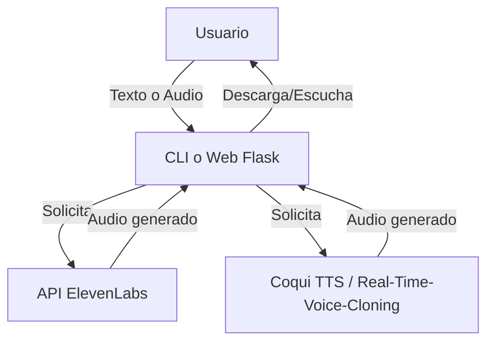
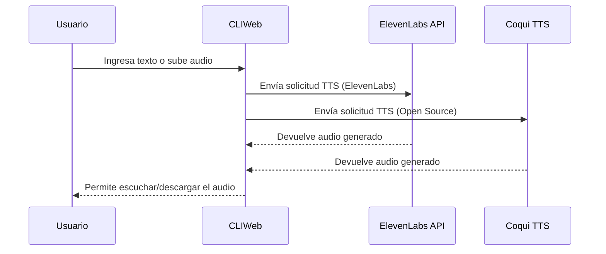

# Demo ElevenLabs: Text to Speech y Voice Cloning

## Descripción

Este proyecto es una demo en español que utiliza la API de ElevenLabs y tecnologías libres para convertir texto a voz (Text to Speech) y clonar voces (Voice Cloning). Incluye dos modos de uso: consola (CLI) y aplicación web con Flask.

---

## Arquitectura General



---

## Flujo de la demo (CLI y Web)



---

## Instalación y Configuración

### 1. Requisitos del Sistema

- **Python 3.9** (recomendado para compatibilidad)
- **Linux/Ubuntu** (probado en Pop!_OS 22.04)
- **Micrófono** (para grabación de audio)

### 2. Instalación de Python 3.9

```bash
# Agregar repositorio deadsnakes (si no está disponible en tu sistema)
sudo add-apt-repository ppa:deadsnakes/ppa -y
sudo apt update

# Instalar Python 3.9
sudo apt install -y python3.9 python3.9-venv python3.9-dev
```

### 3. Crear Entorno Virtual

```bash
# Crear entorno virtual
python3.9 -m venv venv-voice

# Activar entorno virtual
source venv-voice/bin/activate

# Actualizar pip
pip install --upgrade pip wheel setuptools
```

### 4. Instalar Dependencias

```bash
# Instalar dependencias principales
pip install -r requirements.txt
```

### 5. Configurar API Key

Crear archivo `.env` en la raíz del proyecto:

```bash
ELEVENLABS_API_KEY=tu_api_key_aqui
```

---

## Uso

### Modo Consola (CLI)

#### Text to Speech con ElevenLabs

```bash
# Activar entorno virtual
source venv-voice/bin/activate

# Ejecutar TTS con ElevenLabs
python3 app/tts.py --text "Hola, esta es una prueba de ElevenLabs." --output static/elevenlabs_output.mp3
```

#### Text to Speech con Coqui TTS (Open Source)

```bash
# Activar entorno virtual
source venv-voice/bin/activate

# Ejecutar TTS con Coqui
python3 app/tts_coqui.py --text "Hola, esta es una prueba de Coqui TTS." --output static/coqui_output.wav
```

#### Grabación de Audio

```bash
# Grabar audio desde micrófono
python3 app/record_audio.py --output static/audio_referencia.wav --duration 5
```

#### Voice Cloning (ElevenLabs)

```bash
# Clonar voz con ElevenLabs (requiere suscripción premium)
python3 app/voice_cloning.py --audio static/audio_referencia.wav --text "Texto a sintetizar." --output static/clone_output.mp3
```

### Modo Web (Flask)

```bash
# Activar entorno virtual
source venv-voice/bin/activate

# Ejecutar aplicación web
python3 app/webapp.py
```

Abrir navegador en: `http://localhost:5000`

---

## Ejemplos de Uso

### Ejemplo 1: Comparación ElevenLabs vs Coqui TTS

```bash
# ElevenLabs (API comercial)
python3 app/tts.py --text "Esta es una demostración de síntesis de voz con ElevenLabs." --output static/elevenlabs_demo.mp3

# Coqui TTS (Open Source)
python3 app/tts_coqui.py --text "Esta es una demostración de síntesis de voz con Coqui TTS." --output static/coqui_demo.wav
```

### Ejemplo 2: Grabación y Clonación

```bash
# 1. Grabar audio de referencia
python3 app/record_audio.py --output static/mi_voz.wav --duration 10

# 2. Clonar voz (si tienes suscripción ElevenLabs)
python3 app/voice_cloning.py --audio static/mi_voz.wav --text "Este texto será leído con mi voz clonada." --output static/voz_clonada.mp3
```

---

## Tecnologías libres recomendadas para TTS y Voice Cloning

- **Coqui TTS:** Motor TTS open source, multilingüe y con soporte para voces personalizadas. [https://github.com/coqui-ai/TTS](https://github.com/coqui-ai/TTS)
- **Mozilla TTS:** Proyecto original de Mozilla, ahora mantenido por la comunidad. [https://github.com/mozilla/TTS](https://github.com/mozilla/TTS)
- **espeak-ng:** Sintetizador ligero y rápido, soporta muchos idiomas. [https://github.com/espeak-ng/espeak-ng](https://github.com/espeak-ng/espeak-ng)
- **Real-Time-Voice-Cloning:** Clonación de voz en tiempo real. [https://github.com/CorentinJ/Real-Time-Voice-Cloning](https://github.com/CorentinJ/Real-Time-Voice-Cloning)

### Ventajas de las tecnologías libres:

- **Sin costos:** No requieren suscripciones o pagos
- **Privacidad:** Procesamiento local, sin envío de datos
- **Personalización:** Control total sobre modelos y parámetros
- **Transparencia:** Código abierto y auditable

### Consideraciones:

- **Requisitos de hardware:** Pueden requerir más recursos computacionales
- **Calidad:** Puede variar según el modelo y configuración
- **Configuración:** Puede requerir más tiempo de configuración inicial

---

## Estructura del Proyecto

```
elevenlabs-demo/
├── app/                      # Código fuente principal
│   ├── __init__.py
│   ├── tts.py                # ElevenLabs TTS
│   ├── tts_coqui.py          # Coqui TTS (Open Source)
│   ├── voice_cloning.py      # Voice Cloning (ElevenLabs)
│   ├── voice_cloning_coqui.py # Voice Cloning (Open Source)
│   ├── record_audio.py       # Grabación de audio
│   └── webapp.py             # Aplicación Flask
├── static/                   # Archivos estáticos (audios generados)
├── templates/                # Plantillas HTML
├── requirements.txt          # Dependencias Python
├── .env.example              # Ejemplo de variables de entorno
├── .gitignore               # Archivos a ignorar
└── README.md                # Este archivo
```

---

## Solución de Problemas

### Error: "ModuleNotFoundError: No module named 'sounddevice'"

```bash
# Instalar dependencias del sistema
sudo apt install libportaudio2 portaudio19-dev

# Reinstalar dependencias Python
pip install -r requirements.txt
```

### Error: "API key missing permissions"

Tu API Key de ElevenLabs no tiene permisos para Voice Cloning. Esto requiere una suscripción premium.

### Error: "LLVM library not found"

```bash
# Instalar LLVM
sudo apt install llvm llvm-dev

# Reinstalar numba
pip install numba
```

---

## Contribuir

1. Fork el proyecto
2. Crea una rama para tu feature (`git checkout -b feature/AmazingFeature`)
3. Commit tus cambios (`git commit -m 'Add some AmazingFeature'`)
4. Push a la rama (`git push origin feature/AmazingFeature`)
5. Abre un Pull Request

---

## Licencia

Este proyecto está bajo la Licencia MIT. Ver el archivo `LICENSE` para más detalles.

---

## Agradecimientos

- [ElevenLabs](https://elevenlabs.io/) por su API de síntesis de voz
- [Coqui AI](https://coqui.ai/) por Coqui TTS
- [Real-Time-Voice-Cloning](https://github.com/CorentinJ/Real-Time-Voice-Cloning) por la implementación de clonación de voz 