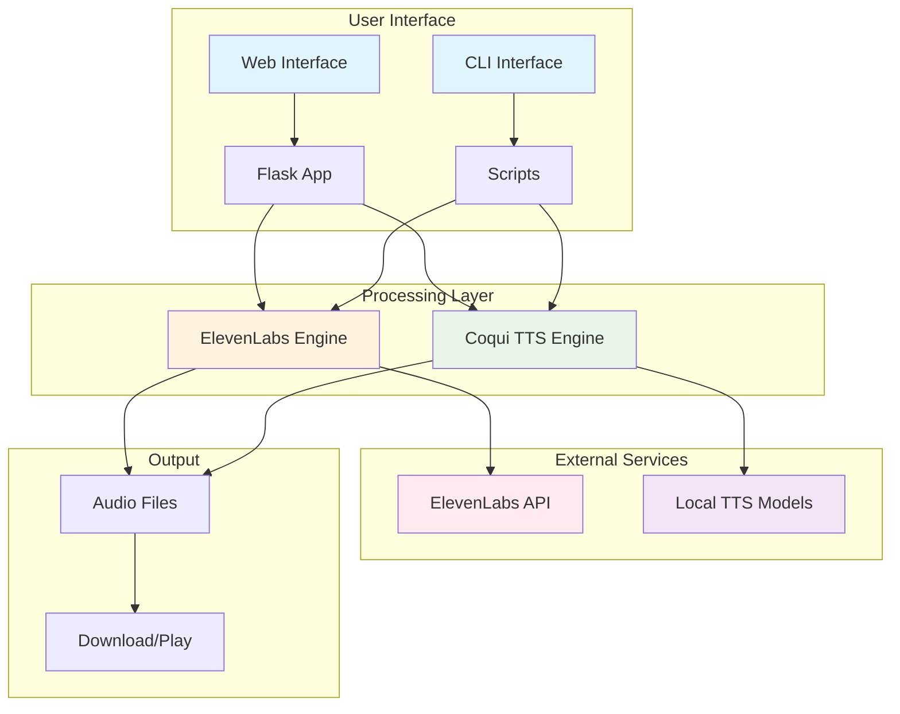
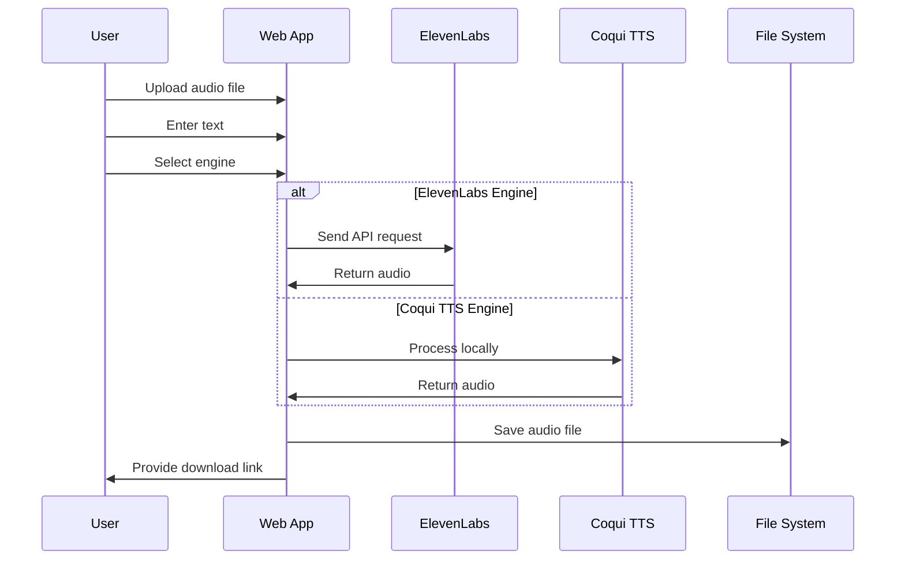
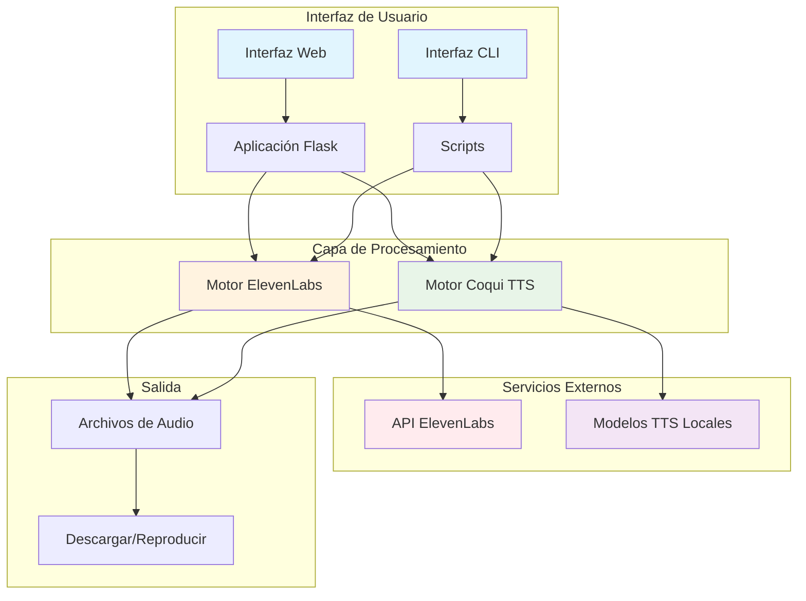
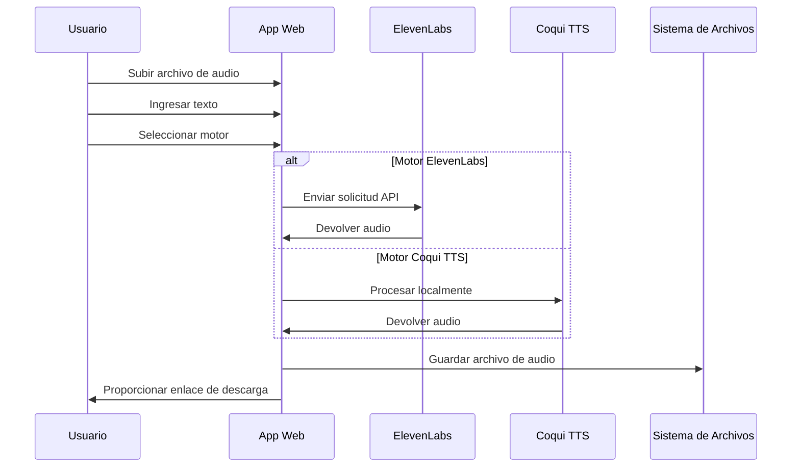

# ElevenLabs & Coqui TTS Demo / Demo de ElevenLabs y Coqui TTS

[](https://www.python.org/)
[](https://flask.palletsprojects.com/)
[](https://elevenlabs.io/)
[](https://github.com/coqui-ai/TTS)
[](https://pytorch.org/)
[](LICENSE)
[](https://github.com/your-repo/elevenLabs)

[](https://github.com/your-repo/elevenLabs)
[](https://github.com/your-repo/elevenLabs)
[](https://github.com/your-repo/elevenLabs)
[](https://github.com/your-repo/elevenLabs)

[English](#english) | [Español](#español)

---

## English

### 🎯 Overview

A comprehensive demo showcasing Text-to-Speech (TTS) and Voice Cloning capabilities using both **ElevenLabs API** (commercial) and **Coqui TTS** (open source). The project includes both CLI and web interfaces.

### 🚀 Features

- **Text-to-Speech**: Convert text to natural-sounding speech
- **Voice Cloning**: Clone voices from audio samples
- **Dual Engine Support**: ElevenLabs API + Coqui TTS (open source)
- **Web Interface**: Modern Flask-based web application
- **CLI Interface**: Command-line tools for automation
- **Audio Recording**: Built-in audio recording capabilities
- **File Management**: Upload, process, and download audio files

### 🛠️ Technologies Used

| Category | Technology | Version | Purpose |
|----------|------------|---------|---------|
| **Backend** | Python | 3.10+ | Core programming language |
| **Web Framework** | Flask | 3.1.1 | Web application framework |
| **TTS Commercial** | ElevenLabs API | Latest | High-quality text-to-speech |
| **TTS Open Source** | Coqui TTS | 0.22.0 | Local text-to-speech engine |
| **Machine Learning** | PyTorch | 2.7.1 | Deep learning framework |
| **Audio Processing** | torchaudio | 2.7.1 | Audio processing library |
| **Audio Analysis** | librosa | 0.10.0 | Audio analysis and processing |
| **Scientific Computing** | NumPy | 1.22.0 | Numerical computing |
| **Scientific Computing** | SciPy | 1.11.4 | Scientific computing |
| **HTTP Client** | requests | 2.32.4 | API communication |
| **Environment** | python-dotenv | 1.1.1 | Environment variable management |

### 🏗️ Architecture



### 📁 Project Structure

```
elevenLabs/
├── app/                          # Core application files
│   ├── webapp_working.py        # Main Flask web application
│   ├── tts.py                   # ElevenLabs TTS implementation
│   ├── tts_coqui.py             # Coqui TTS implementation
│   ├── voice_cloning.py         # ElevenLabs voice cloning
│   ├── voice_cloning_coqui.py   # Coqui voice cloning
│   └── record_audio.py          # Audio recording utilities
├── templates/                    # HTML templates
│   └── index.html               # Main web interface
├── static/                      # Static files (CSS, JS, audio)
├── venv-elevenlabs/             # ElevenLabs virtual environment
├── venv-coqui/                  # Coqui TTS virtual environment
├── setup_environments.py        # Environment setup script
├── requirements.txt             # Python dependencies
├── env.example                  # Environment variables template
└── README.md                    # This file
```

### 🛠️ Installation

#### Prerequisites
- Python 3.10+
- 5GB+ free disk space (for Coqui TTS models)
- ElevenLabs API key (optional, for ElevenLabs features)

#### Quick Setup

1. **Clone the repository**
   ```bash
   git clone <repository-url>
   cd elevenLabs
   ```

2. **Run the setup script**
   ```bash
   python3 setup_environments.py
   ```

3. **Configure environment variables**
   ```bash
   cp env.example .env
   # Edit .env and add your ElevenLabs API key
   ```

4. **Start the web application**
   ```bash
   source venv-elevenlabs/bin/activate
   python app/webapp_working.py
   ```

5. **Access the web interface**
   Open http://localhost:8080 in your browser

### 🎮 Usage

#### Web Interface

1. **Text-to-Speech**
   - Enter text in the TTS section
   - Choose engine (ElevenLabs or Coqui)
   - Click "Generate TTS"
   - Download or play the generated audio

2. **Voice Cloning**
   - Upload an audio file (WAV, MP3)
   - Enter text to be spoken in the cloned voice
   - Choose engine (ElevenLabs or Coqui)
   - Click "Clone Voice"
   - Download or play the cloned audio

#### CLI Usage

```bash
# TTS with ElevenLabs
source venv-elevenlabs/bin/activate
python app/tts.py "Hello, this is a test"

# TTS with Coqui
source venv-coqui/bin/activate
python app/tts_coqui.py --text "Hello, this is a test" --output output.wav

# Voice cloning with Coqui
python app/voice_cloning_coqui.py --audio sample.wav --text "New text" --output cloned.wav
```

### 🔧 Configuration

#### Environment Variables
```bash
# ElevenLabs API Configuration
ELEVENLABS_API_KEY=your_api_key_here
ELEVENLABS_VOICE_ID=default_voice_id

# Web Application
FLASK_ENV=development
FLASK_DEBUG=True
```

#### Virtual Environments
- **venv-elevenlabs**: Flask, requests, python-dotenv
- **venv-coqui**: TTS, torch, torchaudio, and ML dependencies

### 🐛 Troubleshooting

#### Common Issues

1. **"No space left on device"**
   ```bash
   # Clean up space
   sudo apt autoremove -y
   sudo apt clean
   pip cache purge
   ```

2. **Coqui TTS import errors**
   ```bash
   # Reinstall in the correct environment
   source venv-coqui/bin/activate
   pip install TTS
   ```

3. **ElevenLabs API errors**
   - Verify your API key in `.env`
   - Check your ElevenLabs account balance
   - Ensure internet connectivity

4. **Web app not starting**
   ```bash
   # Check if port 8080 is available
   lsof -i :8080
   # Or change port in webapp_working.py
   ```

### 📊 Performance Comparison

| Feature | ElevenLabs | Coqui TTS |
|---------|------------|-----------|
| **Quality** | High | Good |
| **Speed** | Fast | Moderate |
| **Cost** | Paid | Free |
| **Offline** | No | Yes |
| **Setup** | Easy | Complex |
| **Customization** | Limited | High |

### 🔄 Workflow Diagram



### 🤝 Contributing

1. Fork the repository
2. Create a feature branch
3. Make your changes
4. Test thoroughly
5. Submit a pull request

### 📄 License

This project is licensed under the MIT License - see the LICENSE file for details.

---

## Español

### 🎯 Descripción General

Una demo completa que muestra las capacidades de Text-to-Speech (TTS) y Clonación de Voz usando tanto la **API de ElevenLabs** (comercial) como **Coqui TTS** (código abierto). El proyecto incluye interfaces tanto de línea de comandos como web.

### 🚀 Características

- **Text-to-Speech**: Convertir texto a voz natural
- **Clonación de Voz**: Clonar voces desde muestras de audio
- **Soporte Dual**: API de ElevenLabs + Coqui TTS (código abierto)
- **Interfaz Web**: Aplicación web moderna basada en Flask
- **Interfaz CLI**: Herramientas de línea de comandos para automatización
- **Grabación de Audio**: Capacidades de grabación integradas
- **Gestión de Archivos**: Subir, procesar y descargar archivos de audio

### 🛠️ Tecnologías Utilizadas

| Categoría | Tecnología | Versión | Propósito |
|-----------|------------|---------|-----------|
| **Backend** | Python | 3.10+ | Lenguaje de programación principal |
| **Framework Web** | Flask | 3.1.1 | Framework de aplicación web |
| **TTS Comercial** | ElevenLabs API | Última | Text-to-speech de alta calidad |
| **TTS Código Abierto** | Coqui TTS | 0.22.0 | Motor TTS local |
| **Machine Learning** | PyTorch | 2.7.1 | Framework de deep learning |
| **Procesamiento Audio** | torchaudio | 2.7.1 | Biblioteca de procesamiento de audio |
| **Análisis Audio** | librosa | 0.10.0 | Análisis y procesamiento de audio |
| **Computación Científica** | NumPy | 1.22.0 | Computación numérica |
| **Computación Científica** | SciPy | 1.11.4 | Computación científica |
| **Cliente HTTP** | requests | 2.32.4 | Comunicación con APIs |
| **Entorno** | python-dotenv | 1.1.1 | Gestión de variables de entorno |

### 🏗️ Arquitectura



### 📁 Estructura del Proyecto

```
elevenLabs/
├── app/                          # Archivos principales de la aplicación
│   ├── webapp_working.py        # Aplicación web Flask principal
│   ├── tts.py                   # Implementación TTS ElevenLabs
│   ├── tts_coqui.py             # Implementación TTS Coqui
│   ├── voice_cloning.py         # Clonación de voz ElevenLabs
│   ├── voice_cloning_coqui.py   # Clonación de voz Coqui
│   └── record_audio.py          # Utilidades de grabación de audio
├── templates/                    # Plantillas HTML
│   └── index.html               # Interfaz web principal
├── static/                      # Archivos estáticos (CSS, JS, audio)
├── venv-elevenlabs/             # Entorno virtual ElevenLabs
├── venv-coqui/                  # Entorno virtual Coqui TTS
├── setup_environments.py        # Script de configuración de entornos
├── requirements.txt             # Dependencias de Python
├── env.example                  # Plantilla de variables de entorno
└── README.md                    # Este archivo
```

### 🛠️ Instalación

#### Prerrequisitos
- Python 3.10+
- 5GB+ espacio libre en disco (para modelos Coqui TTS)
- Clave API de ElevenLabs (opcional, para funciones ElevenLabs)

#### Configuración Rápida

1. **Clonar el repositorio**
   ```bash
   git clone <url-del-repositorio>
   cd elevenLabs
   ```

2. **Ejecutar el script de configuración**
   ```bash
   python3 setup_environments.py
   ```

3. **Configurar variables de entorno**
   ```bash
   cp env.example .env
   # Editar .env y agregar tu clave API de ElevenLabs
   ```

4. **Iniciar la aplicación web**
   ```bash
   source venv-elevenlabs/bin/activate
   python app/webapp_working.py
   ```

5. **Acceder a la interfaz web**
   Abrir http://localhost:8080 en tu navegador

### 🎮 Uso

#### Interfaz Web

1. **Text-to-Speech**
   - Ingresa texto en la sección TTS
   - Elige motor (ElevenLabs o Coqui)
   - Haz clic en "Generar TTS"
   - Descarga o reproduce el audio generado

2. **Clonación de Voz**
   - Sube un archivo de audio (WAV, MP3)
   - Ingresa texto para ser hablado con la voz clonada
   - Elige motor (ElevenLabs o Coqui)
   - Haz clic en "Clonar Voz"
   - Descarga o reproduce el audio clonado

#### Uso CLI

```bash
# TTS con ElevenLabs
source venv-elevenlabs/bin/activate
python app/tts.py "Hola, esto es una prueba"

# TTS con Coqui
source venv-coqui/bin/activate
python app/tts_coqui.py --text "Hola, esto es una prueba" --output salida.wav

# Clonación de voz con Coqui
python app/voice_cloning_coqui.py --audio muestra.wav --text "Nuevo texto" --output clonado.wav
```

### 🔧 Configuración

#### Variables de Entorno
```bash
# Configuración API ElevenLabs
ELEVENLABS_API_KEY=tu_clave_api_aqui
ELEVENLABS_VOICE_ID=id_voz_por_defecto

# Aplicación Web
FLASK_ENV=development
FLASK_DEBUG=True
```

#### Entornos Virtuales
- **venv-elevenlabs**: Flask, requests, python-dotenv
- **venv-coqui**: TTS, torch, torchaudio y dependencias ML

### 🐛 Solución de Problemas

#### Problemas Comunes

1. **"No queda espacio en el dispositivo"**
   ```bash
   # Limpiar espacio
   sudo apt autoremove -y
   sudo apt clean
   pip cache purge
   ```

2. **Errores de importación Coqui TTS**
   ```bash
   # Reinstalar en el entorno correcto
   source venv-coqui/bin/activate
   pip install TTS
   ```

3. **Errores API ElevenLabs**
   - Verifica tu clave API en `.env`
   - Revisa el saldo de tu cuenta ElevenLabs
   - Asegura conectividad a internet

4. **Aplicación web no inicia**
   ```bash
   # Verificar si el puerto 8080 está disponible
   lsof -i :8080
   # O cambiar puerto en webapp_working.py
   ```

### 📊 Comparación de Rendimiento

| Característica | ElevenLabs | Coqui TTS |
|----------------|------------|-----------|
| **Calidad** | Alta | Buena |
| **Velocidad** | Rápida | Moderada |
| **Costo** | Pago | Gratis |
| **Sin Conexión** | No | Sí |
| **Configuración** | Fácil | Compleja |
| **Personalización** | Limitada | Alta |

### 🔄 Diagrama de Flujo



### 🤝 Contribuir

1. Haz fork del repositorio
2. Crea una rama de características
3. Realiza tus cambios
4. Prueba exhaustivamente
5. Envía un pull request

### 📄 Licencia

Este proyecto está licenciado bajo la Licencia MIT - ver el archivo LICENSE para detalles. 