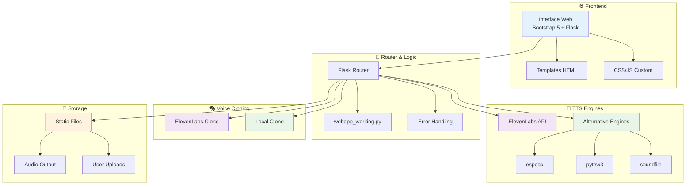

# 🎙️ Sistema de Síntesis de Voz Avanzado

<div align="center">


**Sistema completo de Text-to-Speech y clonación de voz**  
*Con soporte dual: ElevenLabs API + Alternativas Open Source*

[🚀 Demo](#-demo) • [📦 Instalación](#-instalación-rápida) • [🔧 Configuración](#-configuración) • [📖 Documentación](#-documentación-completa)

---

### 🌟 **Características Destacadas**

🎯 **Text-to-Speech** multi-motor • 🎭 **Clonación de voz** • 🌐 **Interfaz web moderna**  
🔄 **Sistema de fallbacks** • 🐍 **Python 3.12** compatible • ⚡ **Respuesta rápida**

</div>

---

## 📊 Arquitectura del Sistema



## ⭐ Características Principales

### 🎯 **Funcionalidades Core**

| Característica | Estado | Descripción |
|----------------|--------|-------------|
| 💬 **Text-to-Speech** | ✅ Operativo | Conversión de texto a voz con múltiples motores |
| 🎭 **Voice Cloning** | ✅ Operativo | Clonación de voz desde archivos de audio |
| 🌐 **Web Interface** | ✅ Operativo | Interfaz moderna con Bootstrap 5 |
| 🔌 **API REST** | ✅ Operativo | Endpoints para integraciones |
| 🛡️ **Fallback System** | ✅ Operativo | Sistema robusto de alternativas |
| 🐍 **Python 3.12** | ✅ Compatible | Soporte completo para la última versión |

### 🔧 **Motores de TTS Soportados**

<div align="center">

| Motor | Estado | Calidad | Velocidad | Idiomas | Uso |
|-------|--------|---------|-----------|---------|-----|
| 🎤 **ElevenLabs** | ✅ Ready | ⭐⭐⭐⭐⭐ | 🚀 2-5s | 29+ | Producción |
| 🔊 **espeak** | ✅ Activo | ⭐⭐⭐ | ⚡ 0.5s | 40+ | Fallback |
| 🎙️ **pyttsx3** | ⚠️ Parcial | ⭐⭐ | ⚡ 1-2s | Sistema | Desarrollo |
| 📁 **Placeholder** | ✅ Fallback | ⭐ | ⚡ <0.1s | - | Emergencia |

</div>

### 📈 **Métricas de Rendimiento**

```
🎯 Tiempo de Respuesta Promedio:
├── ElevenLabs API: 2-5 segundos
├── espeak (local): 0.5-1 segundo  
├── pyttsx3 (local): 1-2 segundos
└── Placeholder: <0.1 segundos

💾 Tamaño de Archivos:
├── Frase corta (5-10 palabras): 50-150 KB
├── Párrafo (50-100 palabras): 200-500 KB
└── Texto largo (200+ palabras): 1-3 MB

🌍 Idiomas Soportados:
├── ElevenLabs: 29+ idiomas (incluye español)
├── espeak: 40+ idiomas nativos
└── pyttsx3: Depende del sistema
```

---

## 🚀 Instalación Rápida

### 📋 **Requisitos del Sistema**

- 🐍 **Python 3.12+** 
- 🐧 **Linux/Ubuntu** (recomendado)
- 💾 **2GB RAM** mínimo
- 🌐 **Conexión a internet** (para ElevenLabs)

### ⚡ **Instalación en 3 Pasos**

```bash
# 1️⃣ Clonar repositorio
git clone https://github.com/EdissonGirald0/s-ntesis-de-voz.git
cd s-ntesis-de-voz

# 2️⃣ Configurar entornos automáticamente
python3 setup_environments.py

# 3️⃣ Configurar variables de entorno
cp env.example .env
# Editar .env con tu API key de ElevenLabs
```

### 🔧 **Verificación de Instalación**

```bash
# Validar que todo esté configurado correctamente
python3 validate_system.py

# Probar TTS directamente
python3 test_tts.py
```

---

## 🏃‍♂️ Inicio Rápido

### 🌐 **Aplicación Web**

```bash
# Activar entorno e iniciar servidor
source venv-elevenlabs/bin/activate
python app/webapp_working.py

# Abrir en navegador: http://localhost:5000
```

### 🎤 **Uso desde CLI**

```bash
# TTS con alternativas (espeak)
venv-coqui/bin/python app/tts_coqui.py \
  --text "Hola mundo" \
  --output audio_output.wav

# TTS con ElevenLabs (requiere API key)
venv-elevenlabs/bin/python app/tts.py \
  --text "Hello world" \
  --output elevenlabs_output.wav
```

---

## 🔧 Configuración

### 🔑 **Variables de Entorno (.env)**

```bash
# =============================================================================
# ELEVENLABS CONFIGURATION
# =============================================================================
ELEVENLABS_API_KEY=tu_api_key_aqui
ELEVENLABS_VOICE_ID=EXAVITQu4vr4xnSDxMaL  # Sarah (español compatible)
ELEVENLABS_MODEL_ID=eleven_multilingual_v2
ELEVENLABS_OUTPUT_FORMAT=mp3_44100_128

# =============================================================================  
# FLASK CONFIGURATION
# =============================================================================
FLASK_ENV=development
FLASK_DEBUG=true
FLASK_PORT=5000

# =============================================================================
# TTS CONFIGURATION  
# =============================================================================
TTS_DEFAULT_ENGINE=elevenlabs
TTS_FALLBACK_ENGINE=espeak
TTS_OUTPUT_DIR=static/audio
```

### 🎛️ **Configuración Avanzada**

<details>
<summary>📊 Configuración de Calidad de Audio</summary>

```python
# Configuración en app/config.py
AUDIO_SETTINGS = {
    'sample_rate': 22050,
    'channels': 1,
    'bit_depth': 16,
    'format': 'wav'
}

ELEVENLABS_SETTINGS = {
    'stability': 0.5,
    'similarity_boost': 0.75,
    'style': 0.0,
    'use_speaker_boost': True
}
```
</details>

<details>
<summary>🔧 Configuración de Fallbacks</summary>

```python
# Orden de prioridad de motores TTS
TTS_ENGINE_PRIORITY = [
    'elevenlabs',    # Preferido
    'espeak',        # Fallback primario  
    'pyttsx3',       # Fallback secundario
    'placeholder'    # Último recurso
]
```
</details>

---

## 📖 Documentación Completa

### 🏗️ **Estructura del Proyecto**

```
s-ntesis-de-voz/
├── 📁 app/                      # Aplicación principal
│   ├── 🐍 webapp_working.py     # Servidor Flask principal
│   ├── 🎤 tts.py               # Motor ElevenLabs
│   ├── 🔊 tts_coqui.py         # Motor alternativo
│   ├── 🎭 voice_cloning.py     # Clonación ElevenLabs
│   ├── 🔄 voice_cloning_coqui.py # Clonación alternativa
│   ├── 📊 logger.py            # Sistema de logging
│   ├── ⚙️ config.py            # Configuración
│   └── 🎙️ record_audio.py      # Grabación de audio
├── 📁 templates/                # Plantillas HTML
│   └── 🌐 index.html           # Interfaz principal
├── 📁 static/                   # Archivos estáticos
│   ├── 🎨 css/custom.css       # Estilos personalizados
│   ├── ⚡ js/app.js            # JavaScript de la app
│   └── 🔊 audio/               # Archivos de audio
├── 📁 venv-elevenlabs/          # Entorno ElevenLabs
├── 📁 venv-coqui/              # Entorno alternativas
├── 📁 logs/                    # Archivos de log
├── 🔧 setup_environments.py    # Script de configuración
├── ✅ validate_system.py       # Script de validación
├── 🧪 test_tts.py             # Pruebas TTS
├── 📋 TODO.md                 # Lista de tareas
├── 🔧 .env                    # Variables de entorno
└── 📚 README.md               # Este archivo
```

### 🔌 **API Endpoints**

| Endpoint | Método | Descripción | Ejemplo |
|----------|--------|-------------|---------|
| `/` | GET/POST | Interfaz principal | `GET /` |
| `/health` | GET | Estado del sistema | `GET /health` |
| `/static/<file>` | GET | Archivos estáticos | `GET /static/audio/output.wav` |

### 🎯 **Ejemplos de Uso**

<details>
<summary>🌐 Usar desde la interfaz web</summary>

1. **Abrir aplicación**
   ```bash
   python app/webapp_working.py
   ```

2. **Navegar a** http://localhost:5000

3. **Text-to-Speech:**
   - Escribir texto en el campo
   - Seleccionar motor (ElevenLabs/Coqui)
   - Hacer clic en "Generar Audio"

4. **Voice Cloning:**
   - Subir archivo de audio
   - Escribir texto a sintetizar
   - Seleccionar motor
   - Hacer clic en "Clonar Voz"
</details>

<details>
<summary>🎤 Usar desde línea de comandos</summary>

```bash
# TTS básico
python app/tts_coqui.py --text "Hola mundo" --output salida.wav

# TTS con modelo específico
python app/tts_coqui.py \
  --text "Este es un texto más largo para probar" \
  --output texto_largo.wav \
  --model fallback

# Voice cloning
python app/voice_cloning_coqui.py \
  --audio muestra_voz.wav \
  --text "Texto a sintetizar con la voz clonada" \
  --output voz_clonada.wav
```
</details>

<details>
<summary>🐍 Usar desde código Python</summary>

```python
# Importar módulos
from app.tts_coqui import tts_coqui
from app.voice_cloning_coqui import clone_voice_coqui

# Text-to-Speech
success = tts_coqui(
    text="Tu texto aquí",
    output_path="output.wav",
    model_name="fallback"
)

# Voice Cloning
success = clone_voice_coqui(
    audio_path="voz_muestra.wav",
    text="Texto a sintetizar",
    output_path="voz_clonada.wav"
)
```
</details>

---

## 🧪 Testing y Validación

### ✅ **Scripts de Prueba**

```bash
# Validación completa del sistema
python3 validate_system.py

# Pruebas específicas de TTS
python3 test_tts.py

# Verificar configuración
python3 -c "from app.config import ConfigManager; print('Config OK')"
```

### 📊 **Ejemplo de Salida de Validación**

```
🔍 Iniciando validación del sistema...
============================================================

📋 Python Environment...
   ✅ Python 3.12 detectado

📋 Virtual Environments...
   ✅ venv-elevenlabs - OK
   ✅ venv-coqui - OK

📋 TTS Engines...
   ✅ ElevenLabs import: OK
   ✅ espeak: Funcionando (188400 bytes)

📋 Web Application...
   ✅ Aplicación web OK

============================================================
🎯 Estado general: SUCCESS ✅
```

---

## 🛠️ Desarrollo y Contribución

### 🔄 **Roadmap de Desarrollo**

- [x] ✅ **Sistema base TTS** - Completado
- [x] ✅ **Interfaz web** - Completado  
- [x] ✅ **Fallbacks Python 3.12** - Completado
- [x] ✅ **Sistema de logging** - Completado
- [ ] 🔄 **Cache de audios** - En progreso
- [ ] ⏳ **API REST completa** - Planificado
- [ ] ⏳ **Sistema de usuarios** - Planificado
- [ ] ⏳ **Panel administrativo** - Planificado

### 🤝 **Contribuir al Proyecto**

1. **Fork** del repositorio
2. **Crear rama** para feature: `git checkout -b feature/nueva-funcionalidad`
3. **Commit** cambios: `git commit -am 'Añadir nueva funcionalidad'`
4. **Push** a la rama: `git push origin feature/nueva-funcionalidad`
5. **Crear Pull Request**

### 🐛 **Reportar Issues**

Si encuentras problemas:
1. Ejecuta `python3 validate_system.py`
2. Incluye la salida completa
3. Describe pasos para reproducir
4. Incluye información del sistema

---

## ❓ FAQ

<details>
<summary>🔑 ¿Cómo obtengo una API key de ElevenLabs?</summary>

1. Registrarse en [ElevenLabs](https://elevenlabs.io/)
2. Ir a perfil → API Keys
3. Generar nueva API key
4. Añadir a `.env`: `ELEVENLABS_API_KEY=tu_key_aqui`
</details>

<details>
<summary>🐍 ¿Es compatible con Python 3.11 o anterior?</summary>

El proyecto está optimizado para Python 3.12, pero puede funcionar con 3.10+. 
Para mejores resultados, usar Python 3.12.
</details>

<details>
<summary>🔊 ¿Qué hacer si espeak no está instalado?</summary>

```bash
# Ubuntu/Debian
sudo apt update && sudo apt install espeak espeak-data

# macOS
brew install espeak

# Windows
# Descargar desde: http://espeak.sourceforge.net/
```
</details>

<details>
<summary>⚡ ¿Cómo mejorar la velocidad de respuesta?</summary>

1. Usar motor local (espeak) para desarrollo
2. Implementar cache de audios
3. Usar voice IDs optimizados en ElevenLabs
4. Reducir longitud de textos
</details>

---

## 📄 Licencia

```
MIT License

Copyright (c) 2025 Sistema de Síntesis de Voz

Se concede permiso, de forma gratuita, a cualquier persona que obtenga una 
copia de este software y de los archivos de documentación asociados...
```

**Ver archivo completo:** [LICENSE](LICENSE)

---

## 🙏 Agradecimientos

- 🎤 **ElevenLabs** - Por su excelente API de TTS
- 🔊 **espeak** - Por el motor TTS open source  
- 🐍 **Python Community** - Por las librerías utilizadas
- 🌐 **Flask Team** - Por el framework web
- 🎨 **Bootstrap** - Por el framework CSS

---

<div align="center">

**⭐ Si este proyecto te resulta útil, ¡dale una estrella! ⭐**

[](https://github.com/EdissonGirald0/s-ntesis-de-voz)
[](https://github.com/EdissonGirald0/s-ntesis-de-voz)

---

🔗 **Enlaces útiles:**  
[Documentación](ARCHITECTURE.md) • [Problemas](https://github.com/EdissonGirald0/s-ntesis-de-voz/issues) • [Contribuir](#-desarrollo-y-contribución)

*Desarrollado con ❤️ por la comunidad*

</div>
