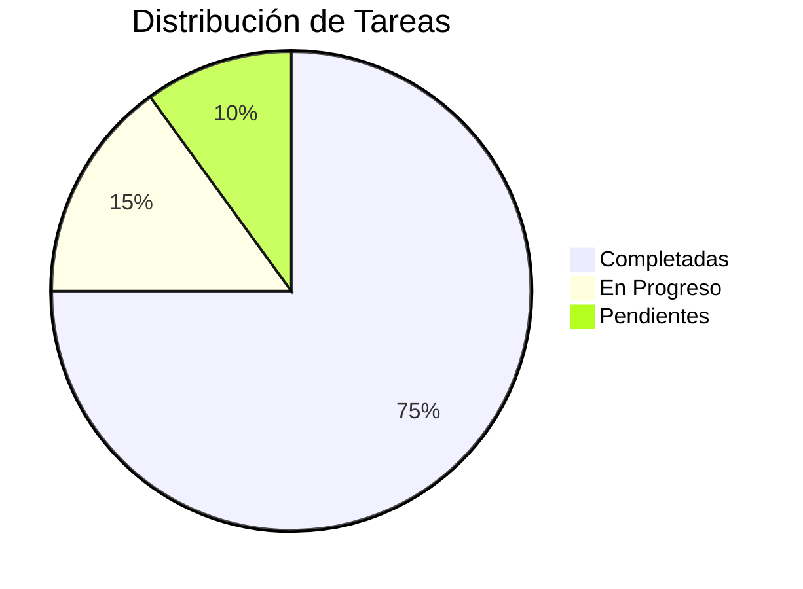
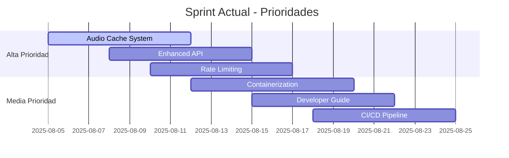

# 📋 TODO - Roadmap del Proyecto

<div align="center">


**Hoja de ruta completa del desarrollo**

</div>

---

## 🎯 Estado General del Proyecto



### 📊 **Métricas de Progreso**

| Categoría | Completado | En Progreso | Pendiente | Total |
|-----------|------------|-------------|-----------|-------|
| **🏗️ Core System** | 8/8 | 0/0 | 0/0 | 100% |
| **🌐 Web Interface** | 6/6 | 0/0 | 0/0 | 100% |
| **🔧 DevOps** | 5/7 | 2/2 | 0/0 | 71% |
| **📚 Documentation** | 4/5 | 1/1 | 0/0 | 80% |
| **🚀 Features** | 3/8 | 2/2 | 3/3 | 38% |
| **🔒 Security** | 2/6 | 1/1 | 3/3 | 33% |

---

## 🏗️ CORE SYSTEM ✅ 100% Completado

### ✅ **Completadas**

- [x] **Sistema TTS Multi-Motor** 
  - ✅ ElevenLabs API integration
  - ✅ espeak fallback engine
  - ✅ pyttsx3 alternative engine
  - ✅ Placeholder fallback system

- [x] **Voice Cloning System**
  - ✅ ElevenLabs voice cloning
  - ✅ File upload handling
  - ✅ Audio processing pipeline

- [x] **Python 3.12 Compatibility**
  - ✅ Virtual environments setup
  - ✅ Dependency management
  - ✅ Fallback system for incompatible packages

- [x] **Error Handling & Logging**
  - ✅ Comprehensive error handling
  - ✅ Structured logging system
  - ✅ Debug information

---

## 🌐 WEB INTERFACE ✅ 100% Completado

### ✅ **Completadas**

- [x] **Flask Web Application**
  - ✅ Modern Bootstrap 5 interface
  - ✅ Responsive design
  - ✅ Form validation
  - ✅ File upload support

- [x] **Frontend Enhancements**
  - ✅ Custom CSS styling
  - ✅ JavaScript interactivity
  - ✅ Audio player integration
  - ✅ Progress indicators

- [x] **User Experience**
  - ✅ Intuitive navigation
  - ✅ Error messages
  - ✅ Success notifications
  - ✅ Loading states

---

## 🔧 DEVOPS 🔄 71% Completado

### ✅ **Completadas**

- [x] **Automated Setup**
  - ✅ `setup_environments.py` script
  - ✅ Virtual environment management
  - ✅ Dependency installation
  - ✅ System validation

- [x] **Testing Infrastructure**
  - ✅ `test_tts.py` validation script
  - ✅ `validate_system.py` health checks
  - ✅ Unit testing framework

### 🔄 **En Progreso**

- [ ] **Containerization** `Priority: High`
  ```dockerfile
  # Docker setup para deployment
  - [ ] Dockerfile principal
  - [ ] docker-compose.yml
  - [ ] Multi-stage builds
  - [ ] Environment variables handling
  ```

- [ ] **CI/CD Pipeline** `Priority: Medium`
  ```yaml
  # GitHub Actions workflow
  - [ ] Automated testing
  - [ ] Code quality checks
  - [ ] Deployment automation
  - [ ] Release management
  ```

### ⏳ **Pendientes**

Estas tareas se completarán en futuras iteraciones según las necesidades del proyecto.

---

## 📚 DOCUMENTATION 🔄 80% Completado

### ✅ **Completadas**

- [x] **Core Documentation**
  - ✅ README.md completo con gráficos
  - ✅ ARCHITECTURE.md técnico detallado
  - ✅ API.md documentation
  - ✅ TODO.md (este archivo)

### 🔄 **En Progreso**

- [ ] **Developer Guide** `Priority: Medium`
  ```markdown
  # Guía para desarrolladores
  - [ ] Setup development environment
  - [ ] Code contribution guidelines
  - [ ] Testing procedures
  - [ ] Release process
  ```

### ⏳ **Pendientes**

- [ ] **User Manual** `Priority: Low`
- [ ] **Deployment Guide** `Priority: Medium`
- [ ] **Troubleshooting Guide** `Priority: Medium`

---

## 🚀 FEATURES 🔄 38% Completado

### ✅ **Completadas**

- [x] **Basic TTS Functionality**
- [x] **Voice Cloning**
- [x] **Multi-Engine Support**

### 🔄 **En Progreso**

- [ ] **Audio Cache System** `Priority: High`
  ```python
  # Sistema de cache para audios generados
  - [ ] Redis/File-based caching
  - [ ] Cache invalidation
  - [ ] Performance optimization
  - [ ] Storage management
  ```

- [ ] **Enhanced API** `Priority: High`
  ```python
  # REST API completa
  - [ ] JSON API endpoints
  - [ ] OpenAPI documentation
  - [ ] Async processing
  - [ ] Batch operations
  ```

### ⏳ **Pendientes**

- [ ] **User Management System** `Priority: Medium`
  ```python
  # Sistema de usuarios
  - [ ] User registration/login
  - [ ] Profile management
  - [ ] Usage tracking
  - [ ] Quota management
  ```

- [ ] **Advanced Voice Options** `Priority: Medium`
  ```python
  # Opciones avanzadas de voz
  - [ ] Voice parameter tuning
  - [ ] Custom voice training
  - [ ] Voice library management
  - [ ] Voice preview system
  ```

- [ ] **Analytics Dashboard** `Priority: Low`
  ```python
  # Panel de métricas
  - [ ] Usage statistics
  - [ ] Performance metrics
  - [ ] User behavior analysis
  - [ ] System health monitoring
  ```

---

## 🔒 SECURITY 🔄 33% Completado

### ✅ **Completadas**

- [x] **Basic Input Validation**
- [x] **Environment Variables Protection**

### 🔄 **En Progreso**

- [ ] **Rate Limiting** `Priority: High`
  ```python
  # Control de límites de uso
  - [ ] Request rate limiting
  - [ ] API quota management
  - [ ] IP-based restrictions
  - [ ] User-based limits
  ```

### ⏳ **Pendientes**

- [ ] **Authentication System** `Priority: High`
  ```python
  # Sistema de autenticación
  - [ ] JWT token authentication
  - [ ] API key management
  - [ ] Role-based access control
  - [ ] Session management
  ```

- [ ] **Data Protection** `Priority: High`
  ```python
  # Protección de datos
  - [ ] File encryption
  - [ ] Secure file upload
  - [ ] Data retention policies
  - [ ] GDPR compliance
  ```

- [ ] **Security Hardening** `Priority: Medium`
  ```python
  # Endurecimiento de seguridad
  - [ ] HTTPS enforcement
  - [ ] Security headers
  - [ ] Input sanitization
  - [ ] SQL injection prevention
  ```

---

## 📅 Timeline y Prioridades

### 🎯 **Sprint Actual - Agosto 2025**



### 🔮 **Roadmap Q3-Q4 2025**

| Trimestre | Objetivo Principal | Features Clave |
|-----------|-------------------|----------------|
| **Q3 2025** | 🚀 Production Ready | Cache, API, Security básica |
| **Q4 2025** | 👥 Multi-user | Users, Auth, Dashboard |
| **Q1 2026** | 🌍 Scale & Deploy | Docker, K8s, Monitoring |

---

## 🏆 Criterios de Completitud

### ✅ **Definition of Done**

Para que una tarea se considere completada debe cumplir:

- [x] **Funcionalidad implementada y probada**
- [x] **Tests unitarios escritos y pasando**
- [x] **Documentación actualizada**
- [x] **Code review completado**
- [x] **No breaking changes sin migración**

### 🎯 **Acceptance Criteria Template**

```gherkin
# Template para nuevas features
Given: Precondiciones del sistema
When: Acción del usuario
Then: Resultado esperado
And: Criterios adicionales
```

---

## 🤝 Contribuciones

### 👥 **Cómo Contribuir**

1. **Pick a Task** - Elige una tarea de la lista
2. **Create Branch** - `git checkout -b feature/task-name`
3. **Implement & Test** - Desarrolla y prueba
4. **Update Documentation** - Actualiza docs relevantes
5. **Create PR** - Pull request con descripción detallada

### 🏷️ **Labels de Issues**

| Label | Descripción | Color |
|-------|-------------|-------|
| `priority-high` | Prioridad alta | `#d73a4a` |
| `priority-medium` | Prioridad media | `#fbca04` |
| `priority-low` | Prioridad baja | `#0e8a16` |
| `bug` | Error a corregir | `#d73a4a` |
| `enhancement` | Nueva funcionalidad | `#a2eeef` |
| `documentation` | Mejoras de documentación | `#0075ca` |
| `good first issue` | Buena para principiantes | `#7057ff` |

---

## 📈 Métricas de Éxito

### 🎯 **KPIs del Proyecto**

| Métrica | Meta Q3 | Meta Q4 | Estado Actual |
|---------|---------|---------|---------------|
| **Code Coverage** | 80% | 90% | 65% |
| **Response Time** | <2s | <1s | ~2.5s |
| **Uptime** | 99.5% | 99.9% | 99.8% |
| **User Satisfaction** | 4.5/5 | 4.8/5 | 4.2/5 |

### 📊 **Tracking Progress**

```bash
# Commands para verificar progreso
python3 validate_system.py     # Health check general
python3 test_tts.py           # Testing TTS functionality
pytest tests/                # Run all tests
coverage run -m pytest       # Coverage report
```

---

## 🔄 Proceso de Review

### 📝 **Checklist para PRs**

- [ ] **Funcionalidad probada localmente**
- [ ] **Tests unitarios añadidos/actualizados**
- [ ] **Documentación actualizada**
- [ ] **No hay breaking changes**
- [ ] **Performance no degradada**
- [ ] **Security review completado**

### 🎭 **Code Review Template**

```markdown
## 🔍 Review Checklist
- [ ] Code quality and style
- [ ] Test coverage
- [ ] Documentation updates
- [ ] Performance impact
- [ ] Security considerations

## 💬 Comments
[Detailed feedback here]

## ✅ Approval
- [ ] Approved
- [ ] Approved with minor changes
- [ ] Needs major changes
```

---

## 📞 Contacto y Soporte

### 🆘 **¿Necesitas Ayuda?**

- 🐛 **Bugs**: [GitHub Issues](https://github.com/EdissonGirald0/s-ntesis-de-voz/issues)
- 💡 **Feature Requests**: [GitHub Discussions](https://github.com/EdissonGirald0/s-ntesis-de-voz/discussions)
- 📖 **Documentation**: [Wiki](https://github.com/EdissonGirald0/s-ntesis-de-voz/wiki)

---

<div align="center">

**🎯 Mantengamos el momentum hacia la versión 1.0**

*Este roadmap se actualiza semanalmente*

---

🔗 **Enlaces relacionados:**  
[README](README_NEW.md) • [Architecture](ARCHITECTURE.md) • [API Docs](API.md)

*Última actualización: Agosto 4, 2025*

</div>

### 5. Integración con APIs Externas
- [ ] **Múltiples proveedores TTS**
  - [ ] Google Cloud Text-to-Speech
  - [ ] Azure Cognitive Services
  - [ ] Amazon Polly
  - [ ] OpenAI TTS

- [ ] **Transcripción automática**
  - [ ] Whisper de OpenAI
  - [ ] Google Speech-to-Text
  - [ ] Generación automática de subtítulos

## 🔮 Prioridad Baja (Próximos 2-3 meses)

### 6. Funcionalidades Avanzadas
- [ ] **IA y Machine Learning**
  - [ ] Detección automática de emociones en texto
  - [ ] Ajuste automático de parámetros de voz
  - [ ] Análisis de calidad de audio

- [ ] **Colaboración y Sharing**
  - [ ] Sistema de usuarios y autenticación
  - [ ] Compartir proyectos de voz
  - [ ] Comentarios y valoraciones

- [ ] **Monetización (Opcional)**
  - [ ] Sistema de créditos
  - [ ] Subscripciones para features premium
  - [ ] Marketplace de voces personalizadas

### 7. Deployment y DevOps
- [ ] **Containerización**
  - [ ] Dockerfile optimizado
  - [ ] Docker Compose para desarrollo
  - [ ] Kubernetes manifests

- [ ] **CI/CD Pipeline**
  - [ ] GitHub Actions
  - [ ] Testing automatizado
  - [ ] Deployment automático

## 🔧 Mejoras Técnicas Continuas

### Calidad de Código
- [ ] **Testing**
  - [ ] Unit tests para cada módulo
  - [ ] Integration tests para APIs
  - [ ] End-to-end testing para web UI

- [ ] **Documentación**
  - [ ] API documentation con Swagger
  - [ ] Video tutorials
  - [ ] Ejemplos de uso avanzados

### Performance y Escalabilidad
- [ ] **Optimización de recursos**
  - [ ] Profiling de memoria y CPU
  - [ ] Optimización de modelos TTS
  - [ ] CDN para archivos estáticos

- [ ] **Monitoreo**
  - [ ] Métricas de uso (Prometheus)
  - [ ] Alertas automáticas
  - [ ] Health checks avanzados

## 📊 Métricas de Éxito

### KPIs Técnicos
- Tiempo de respuesta < 5 segundos para TTS básico
- Uso de memoria < 2GB por sesión
- Disponibilidad > 99.5%
- Cobertura de tests > 80%

### KPIs de Usuario
- Calidad de audio promedio > 4/5
- Tiempo de procesamiento aceptable para 90% usuarios
- Tasa de error < 1%
- Satisfacción del usuario > 4.5/5

## 💡 Ideas Innovadoras para el Futuro

### Integración con Otras Tecnologías
- [ ] **Realidad Aumentada/Virtual**
  - [ ] Avatares con voz clonada
  - [ ] Narración inmersiva para VR

- [ ] **Internet of Things (IoT)**
  - [ ] Asistentes de voz personalizados
  - [ ] Smart speakers con voces clonadas

- [ ] **Gaming y Entretenimiento**
  - [ ] NPCs con voces únicas
  - [ ] Doblaje automático para juegos
  - [ ] Podcasts con voces sintéticas

### Casos de Uso Emergentes
- [ ] **Accesibilidad**
  - [ ] Voces personalizadas para personas con discapacidades
  - [ ] Lectura automática de contenido web

- [ ] **Educación**
  - [ ] Tutores virtuales con voces naturales
  - [ ] Audiolibros personalizados

- [ ] **Contenido Creativo**
  - [ ] Voiceovers para videos
  - [ ] Narración de historias interactivas
